# 05 · Sơ đồ use case (Topic 1)

Sơ đồ use case của hệ thống **Gia Hòa Phát Bakery Supply** (Online Shopping for Baking Ingredients System), vẽ theo bố cục tài liệu mẫu của nhóm: *một sơ đồ tổng quan* rồi *các sơ đồ phân rã*. Tác nhân là **hình người** đứng hai bên khung hệ thống; use case là **elip**; quan hệ kế thừa giữa tác nhân dùng **mũi tên tam giác rỗng**.

**Phủ đủ mọi chức năng người dùng.** Mỗi use case là **một thao tác** người dùng làm được trên giao diện — được trích trực tiếp từ nút, liên kết, tab, menu và thông báo trong mã nguồn (`src/pages`, `src/components`, `src/layouts`), không phải mô tả nhóm chung chung. Sơ đồ tổng quan chỉ cho thấy các nhóm chức năng; **mỗi tác nhân có một hình riêng** (Hình 1.1 → 1.5) với mỗi chức năng một đường nối; mỗi nhóm có một sơ đồ phân rã (Hình 2.1 → 2.19) liệt kê **toàn bộ** thao tác bên trong.

<!-- uc:summary:start -->
5 tác nhân (người) · 4 hệ thống ngoài · **148 use case** · 19 nhóm chức năng · 25 hình · 23 quan hệ «include» · 72 quan hệ «extend» · 3 quan hệ kế thừa
<!-- uc:summary:end -->

- **Dùng cho nhóm:** dán các ảnh `diagrams/uc-*.png` vào mục *Use case diagram* của SRS. Mã `UC-<nhóm>.<số>` do tài liệu này đặt; nếu SRS của nhóm đã có mã khác, sửa trong `diagrams/use-case-data.mjs` rồi chạy lại (mục 9).
- **Dùng cho Antigravity:** đây là tài liệu *tham chiếu* — không phải việc cần làm. Cột "Màn hình" ở mục 8 cho biết mỗi màn hình phục vụ use case nào. **Không sửa, không vẽ lại** các file trong `diagrams/`. Việc duy nhất liên quan tới code là **T18 (tùy chọn)**: trang `/dev/use-cases` hiển thị các sơ đồ này (`03_tasks.md`).
- **Chỉ vẽ chức năng đã có trên giao diện** (xem mục 6). Khi giao diện bổ sung chức năng, thêm use case tương ứng vào `use-case-data.mjs`.
- **Đừng đọc nhầm:** `docs/04_use_cases/*` là mẫu của đề tài đặt lịch (Booking), không phải Topic 1 — xem `README.md` mục 2.

---

## 1. Cách đọc sơ đồ

| Ký hiệu | Ý nghĩa |
|---|---|
| Hình người que | **Tác nhân** — tên tiếng Việt in đậm, vai trò tiếng Anh trong ngoặc (khớp `role` trong ứng dụng) |
| Hình chữ nhật «hệ thống ngoài» | Hệ thống bên ngoài tương tác với hệ thống (ở prototype chỉ mô phỏng) |
| Elip | **Use case**; dòng nhỏ `UC-n.m` là mã (n = nhóm = số cuối của hình, m = số thứ tự trong nhóm). Ở sơ đồ tổng quan, mỗi elip là một **nhóm** chức năng |
| Khung chữ nhật, thẻ tên ở góc trên phải | Ranh giới hệ thống (ở hình phân rã, thẻ ghi tên nhóm chức năng) |
| Đường liền đậm | **Kết hợp trực tiếp** — tác nhân làm use case (hoặc nhóm chức năng) đó |
| Đường liền mờ *(chỉ ở sơ đồ tổng quan)* | Tác nhân **dùng được** nhóm đó nhờ kế thừa, không tự làm riêng |
| Nét đứt, mũi tên hở, «include» | Use case gốc **luôn** gọi use case được bao hàm. Mũi tên đi từ *gốc* tới use case *được bao hàm* |
| Nét đứt, mũi tên hở, «extend» | Hành vi **tùy chọn** mở rộng use case gốc. Mũi tên đi từ use case *mở rộng* tới *gốc* |
| Mũi tên tam giác rỗng | **Kế thừa** — tác nhân con (đầu không có mũi tên) làm được mọi việc của tác nhân cha |

**Cách đọc một hình phân rã.** Cột giữa là các use case mà tác nhân **trực tiếp** làm (có đường liền từ người tới elip). Cột bên phải là các use case **phụ** nối bằng nét đứt — chúng do **cùng tác nhân của use case gốc** thực hiện ngay trong màn hình đó, nên không vẽ thêm đường từ người. Hộp "hệ thống ngoài" nối với use case cần đến nó. Mỗi hình liệt kê **mọi tác nhân dùng được nhóm đó**: tác nhân làm trực tiếp có đường nối tới elip; tác nhân kế thừa (khách lẻ, khách sỉ, quản trị viên) đứng bên dưới chỉ có mũi tên kế thừa — họ làm được mọi use case của tác nhân cha.

## 2. Tác nhân và hệ thống ngoài

Con số bên dưới do script đếm từ dữ liệu: *làm trực tiếp* là use case gắn với tác nhân đó; *kế thừa thêm* là các use case của tác nhân cha.

<!-- uc:actors:start -->
| Tác nhân | Vai trò | Làm trực tiếp | Kế thừa thêm | Tổng chức năng |
|---|---|---|---|---|
| Khách vãng lai | Guest | 36 | — | **36** |
| Khách hàng lẻ | Customer | 38 | 36 (từ Khách vãng lai) | **74** |
| Khách hàng sỉ | Wholesale | 5 | 74 (từ Khách hàng lẻ và cấp trên) | **79** |
| Nhân viên kho và vận hành | Staff | 26 | — | **26** |
| Quản trị viên | Admin | 44 | 26 (từ Nhân viên kho và vận hành) | **70** |
<!-- uc:actors:end -->

Người dùng demo trong ứng dụng: **Trần Mai Anh** (Customer, thợ làm bánh tại gia) · **Lê Hoàng Tuấn** (Wholesale, Chuỗi tiệm bánh Le Parisien) · **Nguyễn Anh Dương** (Admin). Vai trò `staff` có trong kiểu dữ liệu nhưng không có nút chọn nhanh; mọi route đều vào được bằng URL nên có thể xem phần việc của nhân viên qua `/admin/*`.

**Hệ thống ngoài** (ở prototype đều là mô phỏng, không kết nối thật):

<!-- uc:systems:start -->
| Hệ thống ngoài | Dùng ở | Trong prototype |
|---|---|---|
| Cổng thanh toán VNPay / MoMo | UC-7.6 | Khối mã QR tĩnh (public/qr-demo.svg) |
| Dịch vụ Email / SMS | UC-1.8, UC-4.4, UC-4.6, UC-7.1 | Gửi OTP, liên kết đặt lại mật khẩu, email xác nhận, tin nhắn liên hệ — chỉ hiện thông báo trên màn hình |
| Dịch vụ hóa đơn điện tử | UC-5.6, UC-7.7 | Nút "Tải hóa đơn điện tử (PDF)" giả |
| Cảm biến nhiệt độ xe lạnh | UC-5.2, UC-12.2, UC-12.3, UC-12.5 | Số liệu nhiệt độ thùng viết cứng trong mocks/shipments.ts |
<!-- uc:systems:end -->

## 3. Sơ đồ tổng quan

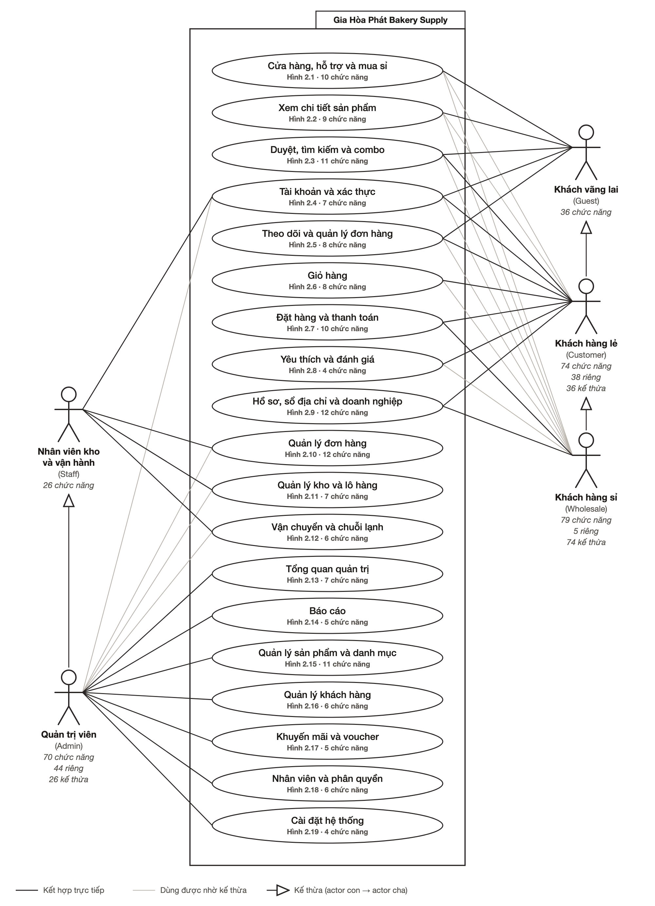

*Hình 1 — Sơ đồ use case tổng quan: 19 nhóm chức năng, kèm số chức năng của từng tác nhân. Khách hàng sỉ kế thừa khách hàng lẻ, khách hàng lẻ kế thừa khách vãng lai; quản trị viên kế thừa nhân viên. Ảnh vector: [`diagrams/uc-00-tong-quan.svg`](diagrams/uc-00-tong-quan.svg).*

Mỗi elip là một nhóm, kèm số hiệu hình phân rã (Hình 2.n) và số chức năng bên trong. **Đường đậm**: tác nhân trực tiếp làm ít nhất một thao tác trong nhóm. **Đường mờ**: tác nhân dùng được nhóm đó nhờ kế thừa (khách lẻ dùng được mọi thứ của khách vãng lai, khách sỉ dùng được mọi thứ của khách lẻ, quản trị viên dùng được mọi thứ của nhân viên). Dưới tên mỗi tác nhân là **tổng số chức năng**, tách thành *riêng* và *kế thừa*, kèm số hiệu hình riêng của tác nhân đó.

Khách hàng sỉ chỉ có ít thao tác riêng vì trong ứng dụng khách sỉ đặt hàng, theo dõi đơn, giỏ hàng… giống hệt khách lẻ (giá bậc thang áp dụng theo số lượng cho mọi khách). Phần riêng của khách sỉ là hồ sơ doanh nghiệp, bảng chiết khấu, hạn mức công nợ và hóa đơn VAT điền sẵn (Hình 2.7 và 2.9).

**Chức năng của từng tác nhân — mỗi chức năng một đường nối.** Sơ đồ tổng quan chỉ nối tác nhân tới *nhóm*, nên mỗi tác nhân có thêm một hình riêng liệt kê **toàn bộ** chức năng của họ: mỗi chức năng là một elip có đường nối riêng tới tác nhân, nên số elip đúng bằng số chức năng ghi ở Hình 1. Chức năng vẽ **đậm** là tác nhân tự làm; chức năng vẽ **mờ** là thừa hưởng từ tác nhân cha (nhóm theo hình phân rã 2.n).

<!-- uc:actorfigs:start -->
### Hình 1.1 — Chức năng của Khách vãng lai (36 chức năng)

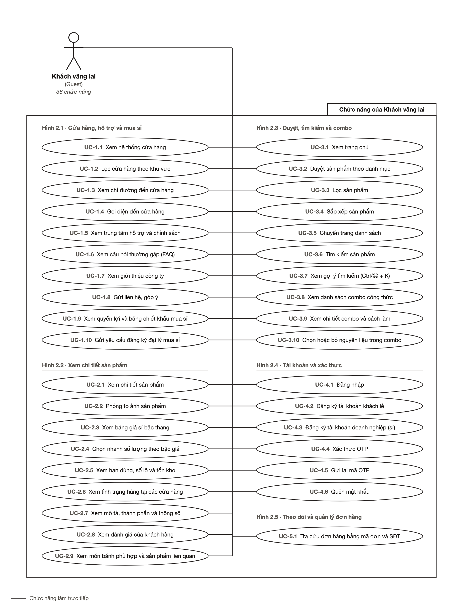

*Hình 1.1 — Guest: **36 chức năng**, mỗi chức năng một đường nối. Ảnh vector: [`diagrams/uc-00-1-khach-vang-lai.svg`](diagrams/uc-00-1-khach-vang-lai.svg).*

### Hình 1.2 — Chức năng của Khách hàng lẻ (74 chức năng)

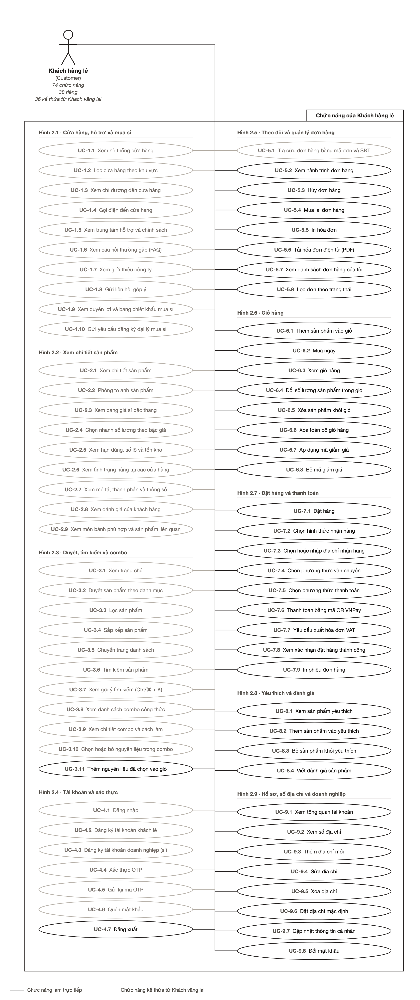

*Hình 1.2 — Customer: **74 chức năng** (38 riêng + 36 kế thừa từ Khách vãng lai), mỗi chức năng một đường nối. Ảnh vector: [`diagrams/uc-00-2-khach-hang-le.svg`](diagrams/uc-00-2-khach-hang-le.svg).*

### Hình 1.3 — Chức năng của Khách hàng sỉ (79 chức năng)

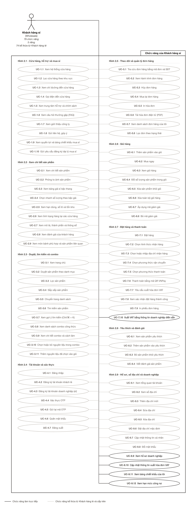

*Hình 1.3 — Wholesale: **79 chức năng** (5 riêng + 74 kế thừa từ Khách hàng lẻ), mỗi chức năng một đường nối. Ảnh vector: [`diagrams/uc-00-3-khach-hang-si.svg`](diagrams/uc-00-3-khach-hang-si.svg).*

### Hình 1.4 — Chức năng của Nhân viên kho và vận hành (26 chức năng)

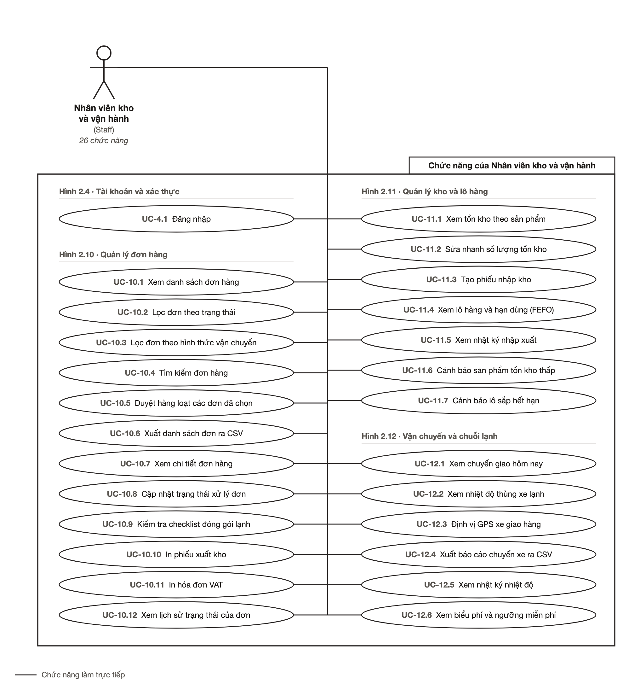

*Hình 1.4 — Staff: **26 chức năng**, mỗi chức năng một đường nối. Ảnh vector: [`diagrams/uc-00-4-nhan-vien-kho.svg`](diagrams/uc-00-4-nhan-vien-kho.svg).*

### Hình 1.5 — Chức năng của Quản trị viên (70 chức năng)

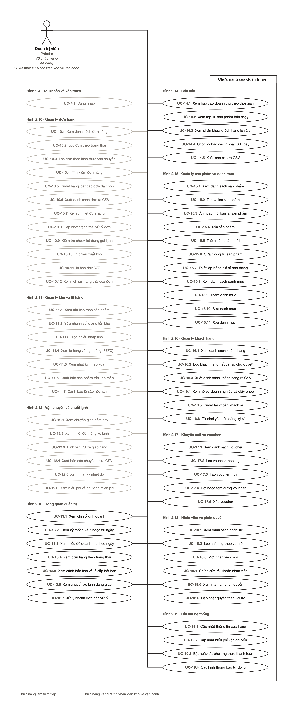

*Hình 1.5 — Admin: **70 chức năng** (44 riêng + 26 kế thừa từ Nhân viên kho và vận hành), mỗi chức năng một đường nối. Ảnh vector: [`diagrams/uc-00-5-quan-tri-vien.svg`](diagrams/uc-00-5-quan-tri-vien.svg).*
<!-- uc:actorfigs:end -->

Bảng các nhóm chức năng:

<!-- uc:groups:start -->
| Hình | Nhóm chức năng | Tác nhân làm trực tiếp | Dùng được thêm nhờ kế thừa | Số use case |
|---|---|---|---|---|
| Hình 2.1 | Cửa hàng, hỗ trợ và mua sỉ | Khách vãng lai | Khách hàng lẻ, Khách hàng sỉ | 10 |
| Hình 2.2 | Xem chi tiết sản phẩm | Khách vãng lai | Khách hàng lẻ, Khách hàng sỉ | 9 |
| Hình 2.3 | Duyệt, tìm kiếm và combo | Khách vãng lai, Khách hàng lẻ | Khách hàng sỉ | 11 |
| Hình 2.4 | Tài khoản và xác thực | Khách vãng lai, Khách hàng lẻ, Nhân viên kho và vận hành | Quản trị viên, Khách hàng sỉ | 7 |
| Hình 2.5 | Theo dõi và quản lý đơn hàng | Khách vãng lai, Khách hàng lẻ | Khách hàng sỉ | 8 |
| Hình 2.6 | Giỏ hàng | Khách hàng lẻ | Khách hàng sỉ | 8 |
| Hình 2.7 | Đặt hàng và thanh toán | Khách hàng lẻ, Khách hàng sỉ | — | 10 |
| Hình 2.8 | Yêu thích và đánh giá | Khách hàng lẻ | Khách hàng sỉ | 4 |
| Hình 2.9 | Hồ sơ, sổ địa chỉ và doanh nghiệp | Khách hàng lẻ, Khách hàng sỉ | — | 12 |
| Hình 2.10 | Quản lý đơn hàng | Nhân viên kho và vận hành | Quản trị viên | 12 |
| Hình 2.11 | Quản lý kho và lô hàng | Nhân viên kho và vận hành | Quản trị viên | 7 |
| Hình 2.12 | Vận chuyển và chuỗi lạnh | Nhân viên kho và vận hành | Quản trị viên | 6 |
| Hình 2.13 | Tổng quan quản trị | Quản trị viên | — | 7 |
| Hình 2.14 | Báo cáo | Quản trị viên | — | 5 |
| Hình 2.15 | Quản lý sản phẩm và danh mục | Quản trị viên | — | 11 |
| Hình 2.16 | Quản lý khách hàng | Quản trị viên | — | 6 |
| Hình 2.17 | Khuyến mãi và voucher | Quản trị viên | — | 5 |
| Hình 2.18 | Nhân viên và phân quyền | Quản trị viên | — | 6 |
| Hình 2.19 | Cài đặt hệ thống | Quản trị viên | — | 4 |
<!-- uc:groups:end -->

## 4. Chức năng của từng tác nhân

Danh sách đầy đủ, nhóm theo hình phân rã. Số trong ngoặc là mã use case ở mục 8.

<!-- uc:peractor:start -->
#### Khách vãng lai (Guest) — 36 chức năng

Người chưa đăng nhập: xem, tìm kiếm, tra cứu đơn, đăng ký, đăng nhập. 36 chức năng.

- **Hình 2.1 — Cửa hàng, hỗ trợ và mua sỉ:** Xem hệ thống cửa hàng (UC-1.1) · Lọc cửa hàng theo khu vực (UC-1.2) · Xem chỉ đường đến cửa hàng (UC-1.3) · Gọi điện đến cửa hàng (UC-1.4) · Xem trung tâm hỗ trợ và chính sách (UC-1.5) · Xem câu hỏi thường gặp (FAQ) (UC-1.6) · Xem giới thiệu công ty (UC-1.7) · Gửi liên hệ, góp ý (UC-1.8) · Xem quyền lợi và bảng chiết khấu mua sỉ (UC-1.9) · Gửi yêu cầu đăng ký đại lý mua sỉ (UC-1.10)
- **Hình 2.2 — Xem chi tiết sản phẩm:** Xem chi tiết sản phẩm (UC-2.1) · Phóng to ảnh sản phẩm (UC-2.2) · Xem bảng giá sỉ bậc thang (UC-2.3) · Chọn nhanh số lượng theo bậc giá (UC-2.4) · Xem hạn dùng, số lô và tồn kho (UC-2.5) · Xem tình trạng hàng tại các cửa hàng (UC-2.6) · Xem mô tả, thành phần và thông số (UC-2.7) · Xem đánh giá của khách hàng (UC-2.8) · Xem món bánh phù hợp và sản phẩm liên quan (UC-2.9)
- **Hình 2.3 — Duyệt, tìm kiếm và combo:** Xem trang chủ (UC-3.1) · Duyệt sản phẩm theo danh mục (UC-3.2) · Lọc sản phẩm (UC-3.3) · Sắp xếp sản phẩm (UC-3.4) · Chuyển trang danh sách (UC-3.5) · Tìm kiếm sản phẩm (UC-3.6) · Xem gợi ý tìm kiếm (Ctrl/⌘ + K) (UC-3.7) · Xem danh sách combo công thức (UC-3.8) · Xem chi tiết combo và cách làm (UC-3.9) · Chọn hoặc bỏ nguyên liệu trong combo (UC-3.10)
- **Hình 2.4 — Tài khoản và xác thực:** Đăng nhập (UC-4.1) · Đăng ký tài khoản khách lẻ (UC-4.2) · Đăng ký tài khoản doanh nghiệp (sỉ) (UC-4.3) · Xác thực OTP (UC-4.4) · Gửi lại mã OTP (UC-4.5) · Quên mật khẩu (UC-4.6)
- **Hình 2.5 — Theo dõi và quản lý đơn hàng:** Tra cứu đơn hàng bằng mã đơn và SĐT (UC-5.1)

#### Khách hàng lẻ (Customer) — 74 chức năng

Thợ làm bánh tại gia, đã đăng nhập: giỏ hàng, đặt hàng, theo dõi đơn, tài khoản. Làm được **toàn bộ 36 chức năng của Khách vãng lai** và thêm 38 chức năng riêng dưới đây.

- **Hình 2.3 — Duyệt, tìm kiếm và combo:** Thêm nguyên liệu đã chọn vào giỏ (UC-3.11)
- **Hình 2.4 — Tài khoản và xác thực:** Đăng xuất (UC-4.7)
- **Hình 2.5 — Theo dõi và quản lý đơn hàng:** Xem hành trình đơn hàng (UC-5.2) · Hủy đơn hàng (UC-5.3) · Mua lại đơn hàng (UC-5.4) · In hóa đơn (UC-5.5) · Tải hóa đơn điện tử (PDF) (UC-5.6) · Xem danh sách đơn hàng của tôi (UC-5.7) · Lọc đơn theo trạng thái (UC-5.8)
- **Hình 2.6 — Giỏ hàng:** Thêm sản phẩm vào giỏ (UC-6.1) · Mua ngay (UC-6.2) · Xem giỏ hàng (UC-6.3) · Đổi số lượng sản phẩm trong giỏ (UC-6.4) · Xóa sản phẩm khỏi giỏ (UC-6.5) · Xóa toàn bộ giỏ hàng (UC-6.6) · Áp dụng mã giảm giá (UC-6.7) · Bỏ mã giảm giá (UC-6.8)
- **Hình 2.7 — Đặt hàng và thanh toán:** Đặt hàng (UC-7.1) · Chọn hình thức nhận hàng (UC-7.2) · Chọn hoặc nhập địa chỉ nhận hàng (UC-7.3) · Chọn phương thức vận chuyển (UC-7.4) · Chọn phương thức thanh toán (UC-7.5) · Thanh toán bằng mã QR VNPay (UC-7.6) · Yêu cầu xuất hóa đơn VAT (UC-7.7) · Xem xác nhận đặt hàng thành công (UC-7.8) · In phiếu đơn hàng (UC-7.9)
- **Hình 2.8 — Yêu thích và đánh giá:** Xem sản phẩm yêu thích (UC-8.1) · Thêm sản phẩm vào yêu thích (UC-8.2) · Bỏ sản phẩm khỏi yêu thích (UC-8.3) · Viết đánh giá sản phẩm (UC-8.4)
- **Hình 2.9 — Hồ sơ, sổ địa chỉ và doanh nghiệp:** Xem tổng quan tài khoản (UC-9.1) · Xem sổ địa chỉ (UC-9.2) · Thêm địa chỉ mới (UC-9.3) · Sửa địa chỉ (UC-9.4) · Xóa địa chỉ (UC-9.5) · Đặt địa chỉ mặc định (UC-9.6) · Cập nhật thông tin cá nhân (UC-9.7) · Đổi mật khẩu (UC-9.8)

#### Khách hàng sỉ (Wholesale) — 79 chức năng

Chủ tiệm bánh, nhà hàng, đại lý có tài khoản doanh nghiệp đã duyệt: giá sỉ, hóa đơn VAT. Làm được **toàn bộ 74 chức năng của Khách hàng lẻ** và thêm 5 chức năng riêng dưới đây.

- **Hình 2.7 — Đặt hàng và thanh toán:** Yêu cầu xuất hóa đơn VAT (UC-7.7) · Xuất VAT bằng thông tin doanh nghiệp điền sẵn (UC-7.10)
- **Hình 2.9 — Hồ sơ, sổ địa chỉ và doanh nghiệp:** Xem hồ sơ doanh nghiệp (UC-9.9) · Cập nhật thông tin xuất hóa đơn VAT (UC-9.10) · Xem bảng chiết khấu của tôi (UC-9.11) · Xem hạn mức công nợ (UC-9.12)

#### Nhân viên kho và vận hành (Staff) — 26 chức năng

Xử lý đơn hàng, kho và hạn dùng, vận chuyển chuỗi lạnh. 26 chức năng.

- **Hình 2.4 — Tài khoản và xác thực:** Đăng nhập (UC-4.1)
- **Hình 2.10 — Quản lý đơn hàng:** Xem danh sách đơn hàng (UC-10.1) · Lọc đơn theo trạng thái (UC-10.2) · Lọc đơn theo hình thức vận chuyển (UC-10.3) · Tìm kiếm đơn hàng (UC-10.4) · Duyệt hàng loạt các đơn đã chọn (UC-10.5) · Xuất danh sách đơn ra CSV (UC-10.6) · Xem chi tiết đơn hàng (UC-10.7) · Cập nhật trạng thái xử lý đơn (UC-10.8) · Kiểm tra checklist đóng gói lạnh (UC-10.9) · In phiếu xuất kho (UC-10.10) · In hóa đơn VAT (UC-10.11) · Xem lịch sử trạng thái của đơn (UC-10.12)
- **Hình 2.11 — Quản lý kho và lô hàng:** Xem tồn kho theo sản phẩm (UC-11.1) · Sửa nhanh số lượng tồn kho (UC-11.2) · Tạo phiếu nhập kho (UC-11.3) · Xem lô hàng và hạn dùng (FEFO) (UC-11.4) · Xem nhật ký nhập xuất (UC-11.5) · Cảnh báo sản phẩm tồn kho thấp (UC-11.6) · Cảnh báo lô sắp hết hạn (UC-11.7)
- **Hình 2.12 — Vận chuyển và chuỗi lạnh:** Xem chuyến giao hôm nay (UC-12.1) · Xem nhiệt độ thùng xe lạnh (UC-12.2) · Định vị GPS xe giao hàng (UC-12.3) · Xuất báo cáo chuyến xe ra CSV (UC-12.4) · Xem nhật ký nhiệt độ (UC-12.5) · Xem biểu phí và ngưỡng miễn phí (UC-12.6)

#### Quản trị viên (Admin) — 70 chức năng

Toàn quyền quản trị: sản phẩm, khách hàng, khuyến mãi, báo cáo, nhân viên, cài đặt. Làm được **toàn bộ 26 chức năng của Nhân viên kho và vận hành** và thêm 44 chức năng riêng dưới đây.

- **Hình 2.13 — Tổng quan quản trị:** Xem chỉ số kinh doanh (UC-13.1) · Chọn kỳ thống kê 7 hoặc 30 ngày (UC-13.2) · Xem biểu đồ doanh thu theo ngày (UC-13.3) · Xem đơn hàng theo trạng thái (UC-13.4) · Xem cảnh báo kho và lô sắp hết hạn (UC-13.5) · Xem chuyến xe lạnh đang giao (UC-13.6) · Xử lý nhanh đơn cần xử lý (UC-13.7)
- **Hình 2.14 — Báo cáo:** Xem báo cáo doanh thu theo thời gian (UC-14.1) · Xem top 10 sản phẩm bán chạy (UC-14.2) · Xem phân khúc khách hàng lẻ và sỉ (UC-14.3) · Chọn kỳ báo cáo 7 hoặc 30 ngày (UC-14.4) · Xuất báo cáo ra CSV (UC-14.5)
- **Hình 2.15 — Quản lý sản phẩm và danh mục:** Xem danh sách sản phẩm (UC-15.1) · Tìm và lọc sản phẩm (UC-15.2) · Ẩn hoặc mở bán lại sản phẩm (UC-15.3) · Xóa sản phẩm (UC-15.4) · Thêm sản phẩm mới (UC-15.5) · Sửa thông tin sản phẩm (UC-15.6) · Thiết lập bảng giá sỉ bậc thang (UC-15.7) · Xem danh sách danh mục (UC-15.8) · Thêm danh mục (UC-15.9) · Sửa danh mục (UC-15.10) · Xóa danh mục (UC-15.11)
- **Hình 2.16 — Quản lý khách hàng:** Xem danh sách khách hàng (UC-16.1) · Lọc khách hàng (tất cả, sỉ, chờ duyệt) (UC-16.2) · Xuất danh sách khách hàng ra CSV (UC-16.3) · Xem hồ sơ doanh nghiệp và giấy phép (UC-16.4) · Duyệt tài khoản khách sỉ (UC-16.5) · Từ chối yêu cầu đăng ký sỉ (UC-16.6)
- **Hình 2.17 — Khuyến mãi và voucher:** Xem danh sách voucher (UC-17.1) · Lọc voucher theo loại (UC-17.2) · Tạo voucher mới (UC-17.3) · Bật hoặc tạm dừng voucher (UC-17.4) · Xóa voucher (UC-17.5)
- **Hình 2.18 — Nhân viên và phân quyền:** Xem danh sách nhân sự (UC-18.1) · Lọc nhân sự theo vai trò (UC-18.2) · Mời nhân viên mới (UC-18.3) · Chỉnh sửa tài khoản nhân viên (UC-18.4) · Xem ma trận phân quyền (UC-18.5) · Cập nhật quyền theo vai trò (UC-18.6)
- **Hình 2.19 — Cài đặt hệ thống:** Cập nhật thông tin cửa hàng (UC-19.1) · Cập nhật biểu phí vận chuyển (UC-19.2) · Bật hoặc tắt phương thức thanh toán (UC-19.3) · Cấu hình thông báo tự động (UC-19.4)
<!-- uc:peractor:end -->

## 5. Sơ đồ phân rã

Mỗi hình liệt kê **mọi** thao tác của một nhóm. Ảnh `.png` đã ở nét x2 để dán thẳng vào Word; file `.svg` là vector.

<!-- uc:figures:start -->
### Hình 2.1 — Cửa hàng, hỗ trợ và mua sỉ

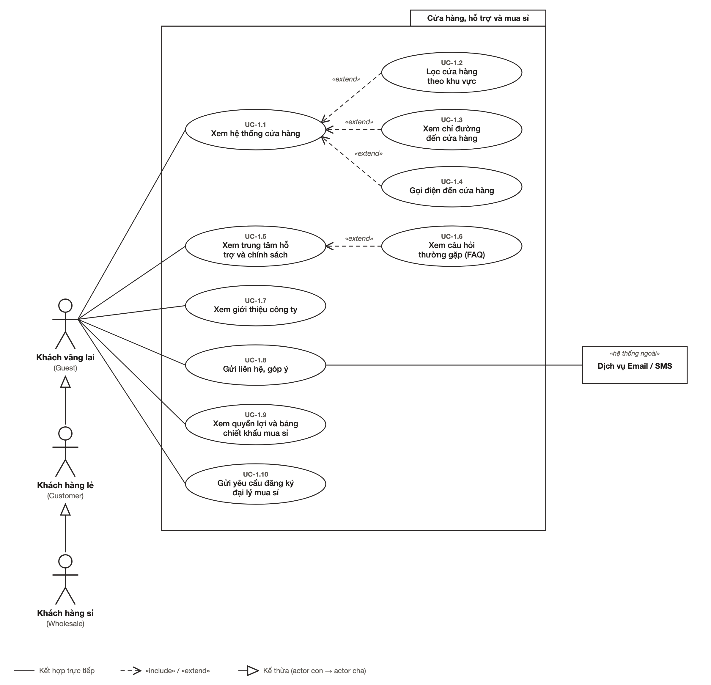

*Hình 2.1 — Cửa hàng, hỗ trợ và mua sỉ. Tác nhân: Khách vãng lai, Khách hàng lẻ, Khách hàng sỉ. Hệ thống ngoài: Dịch vụ Email / SMS. 10 use case: UC-1.1 → UC-1.10. Ảnh vector: [`diagrams/uc-01-cua-hang-ho-tro-mua-si.svg`](diagrams/uc-01-cua-hang-ho-tro-mua-si.svg).*

### Hình 2.2 — Xem chi tiết sản phẩm

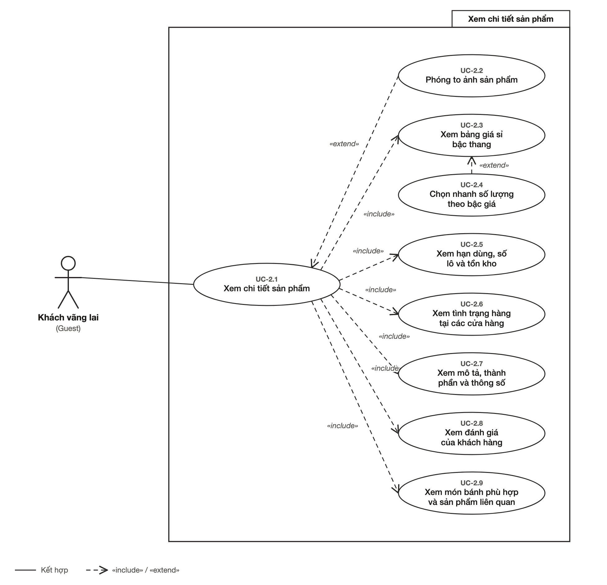

*Hình 2.2 — Xem chi tiết sản phẩm. Tác nhân: Khách vãng lai, Khách hàng lẻ, Khách hàng sỉ. 9 use case: UC-2.1 → UC-2.9. Ảnh vector: [`diagrams/uc-02-chi-tiet-san-pham.svg`](diagrams/uc-02-chi-tiet-san-pham.svg).*

### Hình 2.3 — Duyệt, tìm kiếm và combo

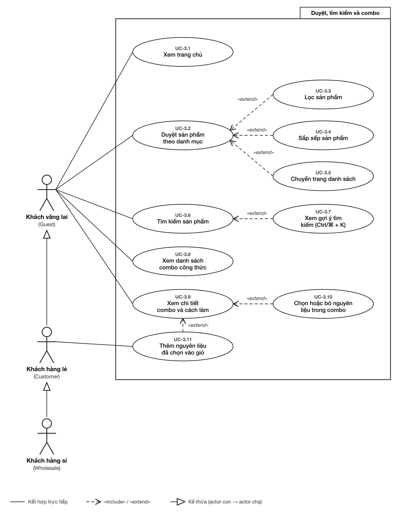

*Hình 2.3 — Duyệt, tìm kiếm và combo. Tác nhân: Khách vãng lai, Khách hàng lẻ, Khách hàng sỉ. 11 use case: UC-3.1 → UC-3.11. Ảnh vector: [`diagrams/uc-03-duyet-tim-kiem-combo.svg`](diagrams/uc-03-duyet-tim-kiem-combo.svg).*

### Hình 2.4 — Tài khoản và xác thực

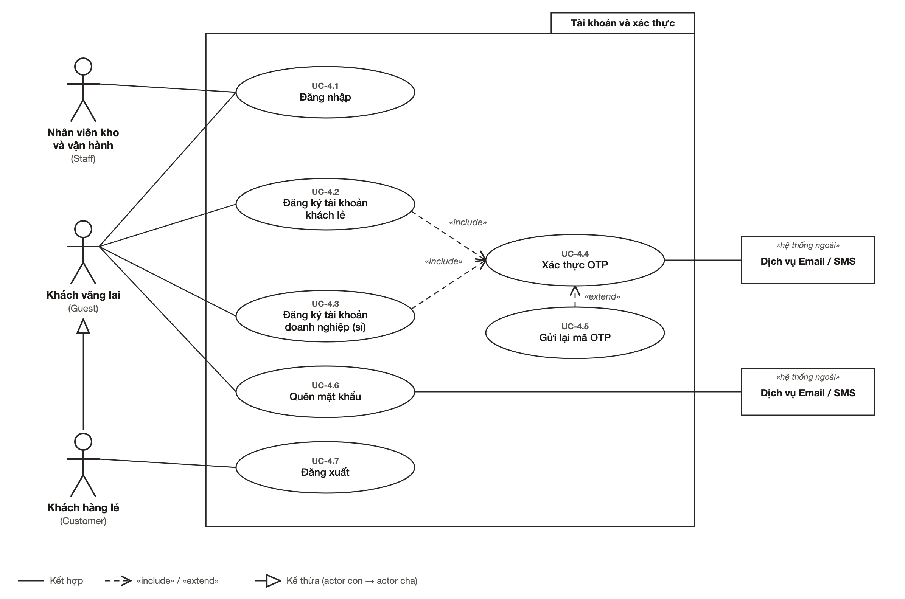

*Hình 2.4 — Tài khoản và xác thực. Tác nhân: Nhân viên kho và vận hành, Quản trị viên, Khách vãng lai, Khách hàng lẻ, Khách hàng sỉ. Hệ thống ngoài: Dịch vụ Email / SMS. 7 use case: UC-4.1 → UC-4.7. Ảnh vector: [`diagrams/uc-04-tai-khoan-xac-thuc.svg`](diagrams/uc-04-tai-khoan-xac-thuc.svg).*

### Hình 2.5 — Theo dõi và quản lý đơn hàng

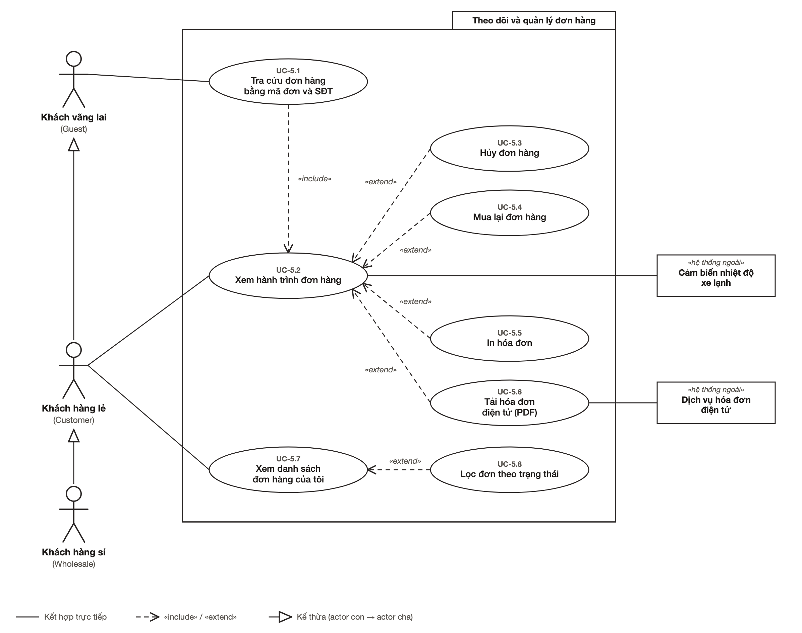

*Hình 2.5 — Theo dõi và quản lý đơn hàng. Tác nhân: Khách vãng lai, Khách hàng lẻ, Khách hàng sỉ. Hệ thống ngoài: Cảm biến nhiệt độ xe lạnh, Dịch vụ hóa đơn điện tử. 8 use case: UC-5.1 → UC-5.8. Ảnh vector: [`diagrams/uc-05-theo-doi-don-hang.svg`](diagrams/uc-05-theo-doi-don-hang.svg).*

### Hình 2.6 — Giỏ hàng

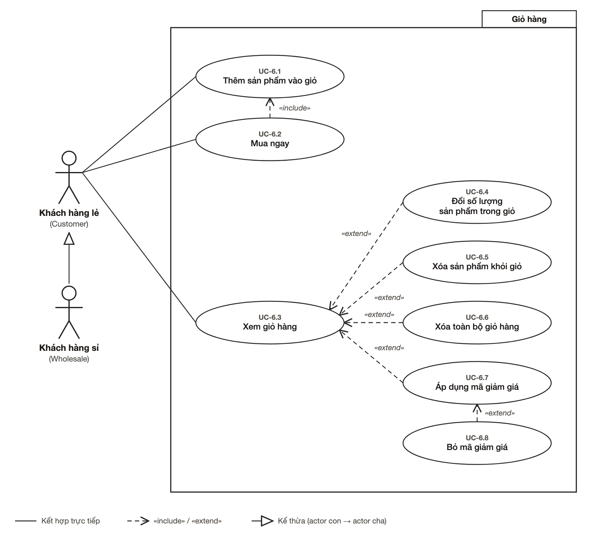

*Hình 2.6 — Giỏ hàng. Tác nhân: Khách hàng lẻ, Khách hàng sỉ. 8 use case: UC-6.1 → UC-6.8. Ảnh vector: [`diagrams/uc-06-gio-hang.svg`](diagrams/uc-06-gio-hang.svg).*

### Hình 2.7 — Đặt hàng và thanh toán

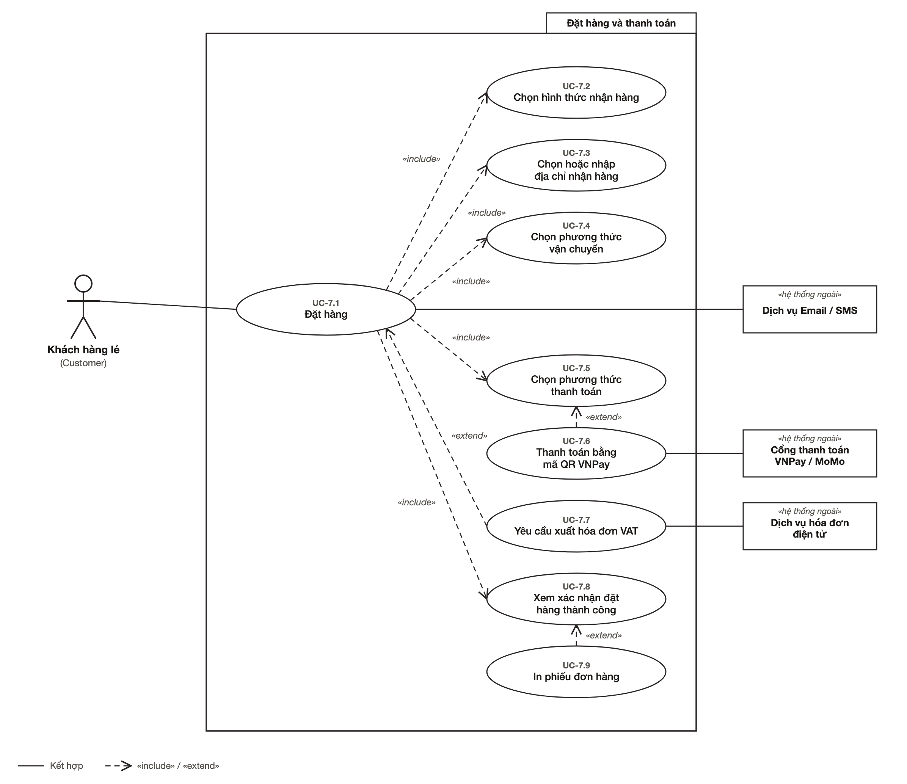

*Hình 2.7 — Đặt hàng và thanh toán. Tác nhân: Khách hàng lẻ, Khách hàng sỉ. Hệ thống ngoài: Dịch vụ Email / SMS, Cổng thanh toán VNPay / MoMo, Dịch vụ hóa đơn điện tử. 10 use case: UC-7.1 → UC-7.10. Ảnh vector: [`diagrams/uc-07-dat-hang-thanh-toan.svg`](diagrams/uc-07-dat-hang-thanh-toan.svg).*

### Hình 2.8 — Yêu thích và đánh giá

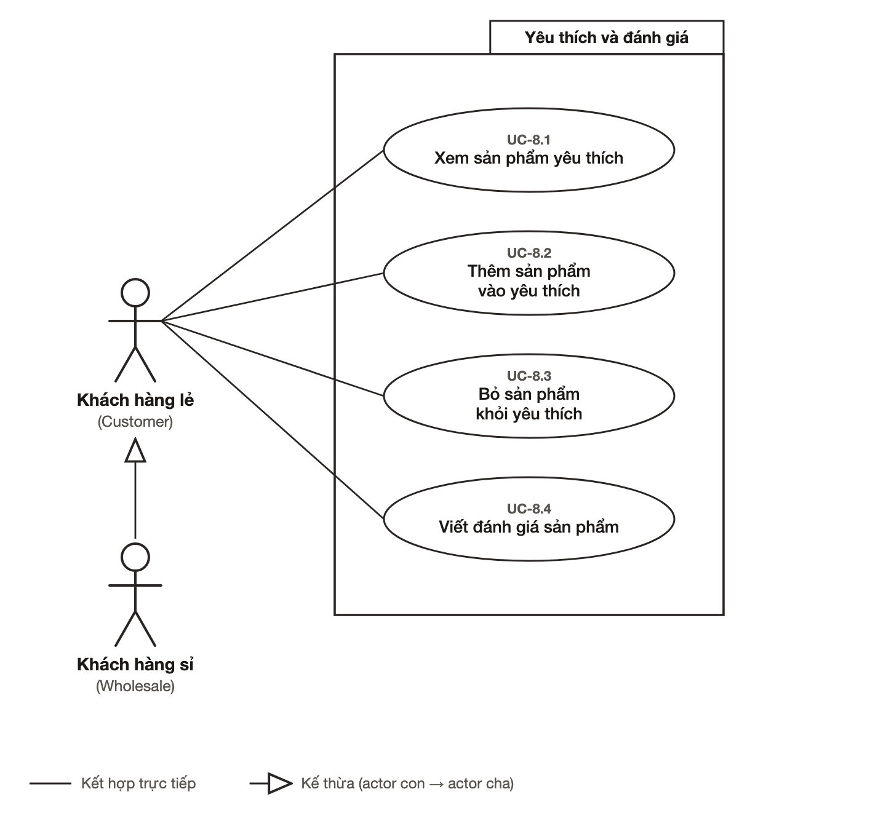

*Hình 2.8 — Yêu thích và đánh giá. Tác nhân: Khách hàng lẻ, Khách hàng sỉ. 4 use case: UC-8.1 → UC-8.4. Ảnh vector: [`diagrams/uc-08-yeu-thich-danh-gia.svg`](diagrams/uc-08-yeu-thich-danh-gia.svg).*

### Hình 2.9 — Hồ sơ, sổ địa chỉ và doanh nghiệp

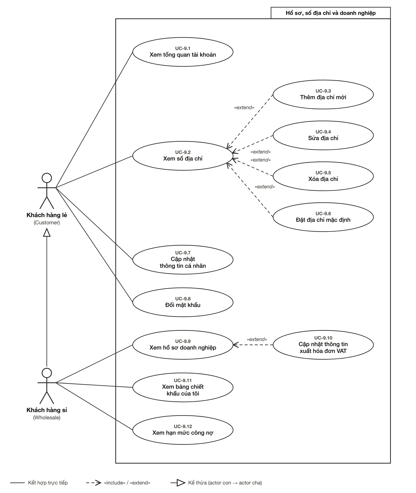

*Hình 2.9 — Hồ sơ, sổ địa chỉ và doanh nghiệp. Tác nhân: Khách hàng lẻ, Khách hàng sỉ. 12 use case: UC-9.1 → UC-9.12. Ảnh vector: [`diagrams/uc-09-ho-so-so-dia-chi.svg`](diagrams/uc-09-ho-so-so-dia-chi.svg).*

### Hình 2.10 — Quản lý đơn hàng

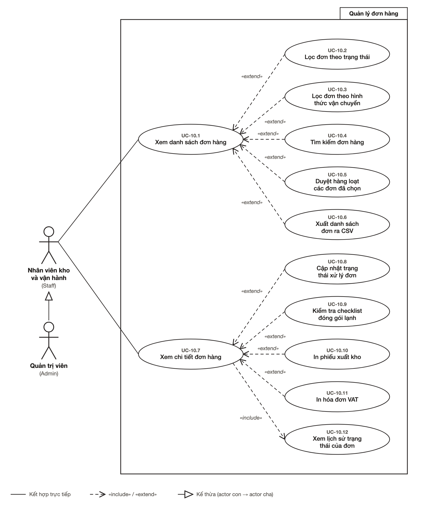

*Hình 2.10 — Quản lý đơn hàng. Tác nhân: Nhân viên kho và vận hành, Quản trị viên. 12 use case: UC-10.1 → UC-10.12. Ảnh vector: [`diagrams/uc-10-quan-ly-don-hang.svg`](diagrams/uc-10-quan-ly-don-hang.svg).*

### Hình 2.11 — Quản lý kho và lô hàng

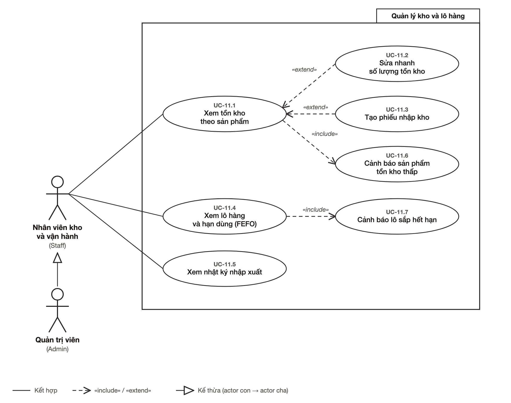

*Hình 2.11 — Quản lý kho và lô hàng. Tác nhân: Nhân viên kho và vận hành, Quản trị viên. 7 use case: UC-11.1 → UC-11.7. Ảnh vector: [`diagrams/uc-11-kho-lo-hang.svg`](diagrams/uc-11-kho-lo-hang.svg).*

### Hình 2.12 — Vận chuyển và chuỗi lạnh

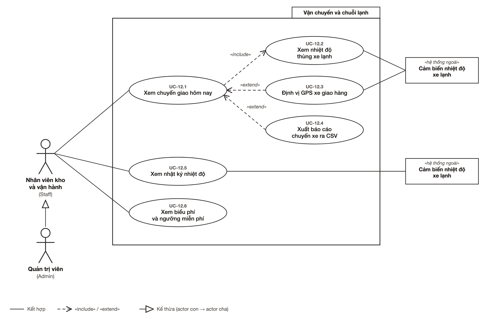

*Hình 2.12 — Vận chuyển và chuỗi lạnh. Tác nhân: Nhân viên kho và vận hành, Quản trị viên. Hệ thống ngoài: Cảm biến nhiệt độ xe lạnh. 6 use case: UC-12.1 → UC-12.6. Ảnh vector: [`diagrams/uc-12-van-chuyen-chuoi-lanh.svg`](diagrams/uc-12-van-chuyen-chuoi-lanh.svg).*

### Hình 2.13 — Tổng quan quản trị

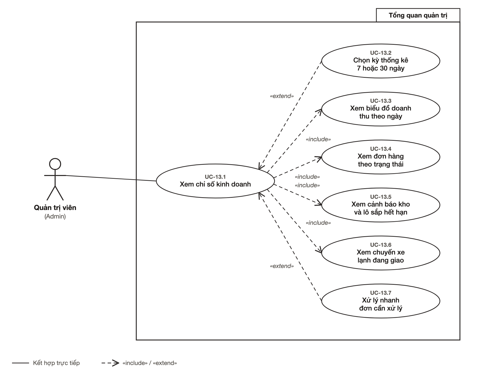

*Hình 2.13 — Tổng quan quản trị. Tác nhân: Quản trị viên. 7 use case: UC-13.1 → UC-13.7. Ảnh vector: [`diagrams/uc-13-tong-quan-quan-tri.svg`](diagrams/uc-13-tong-quan-quan-tri.svg).*

### Hình 2.14 — Báo cáo

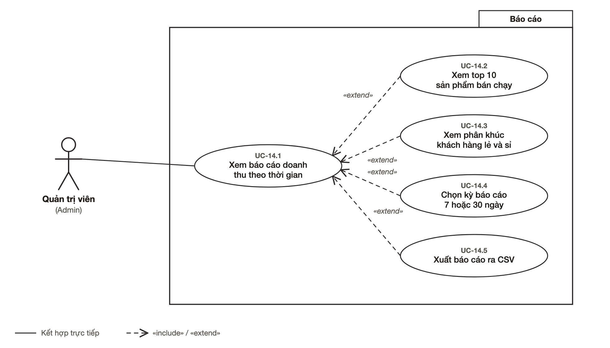

*Hình 2.14 — Báo cáo. Tác nhân: Quản trị viên. 5 use case: UC-14.1 → UC-14.5. Ảnh vector: [`diagrams/uc-14-bao-cao.svg`](diagrams/uc-14-bao-cao.svg).*

### Hình 2.15 — Quản lý sản phẩm và danh mục

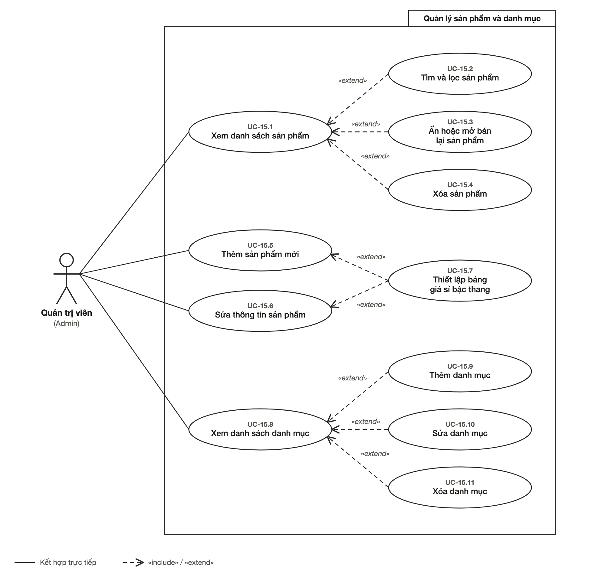

*Hình 2.15 — Quản lý sản phẩm và danh mục. Tác nhân: Quản trị viên. 11 use case: UC-15.1 → UC-15.11. Ảnh vector: [`diagrams/uc-15-san-pham-danh-muc.svg`](diagrams/uc-15-san-pham-danh-muc.svg).*

### Hình 2.16 — Quản lý khách hàng

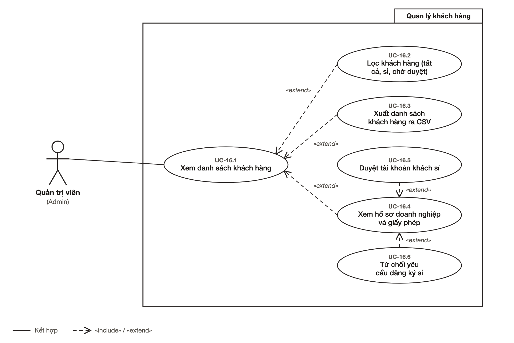

*Hình 2.16 — Quản lý khách hàng. Tác nhân: Quản trị viên. 6 use case: UC-16.1 → UC-16.6. Ảnh vector: [`diagrams/uc-16-khach-hang.svg`](diagrams/uc-16-khach-hang.svg).*

### Hình 2.17 — Khuyến mãi và voucher

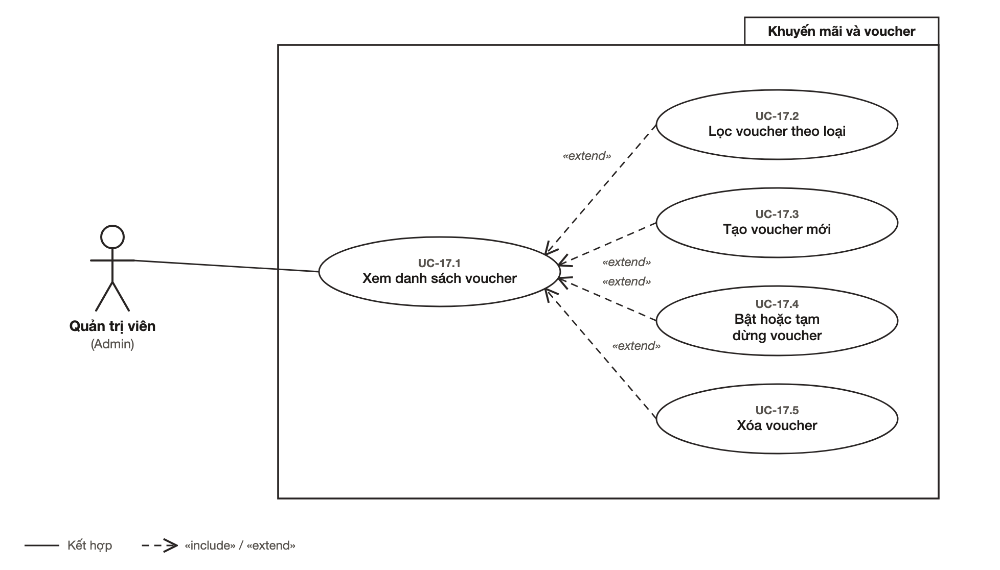

*Hình 2.17 — Khuyến mãi và voucher. Tác nhân: Quản trị viên. 5 use case: UC-17.1 → UC-17.5. Ảnh vector: [`diagrams/uc-17-khuyen-mai.svg`](diagrams/uc-17-khuyen-mai.svg).*

### Hình 2.18 — Nhân viên và phân quyền

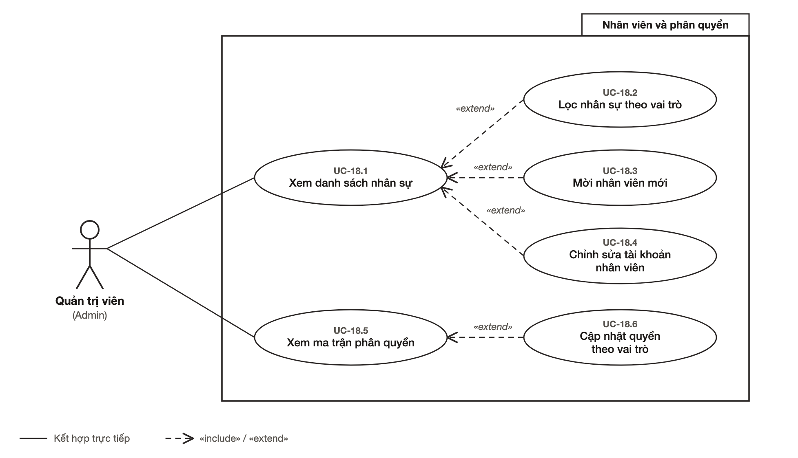

*Hình 2.18 — Nhân viên và phân quyền. Tác nhân: Quản trị viên. 6 use case: UC-18.1 → UC-18.6. Ảnh vector: [`diagrams/uc-18-nhan-vien-phan-quyen.svg`](diagrams/uc-18-nhan-vien-phan-quyen.svg).*

### Hình 2.19 — Cài đặt hệ thống

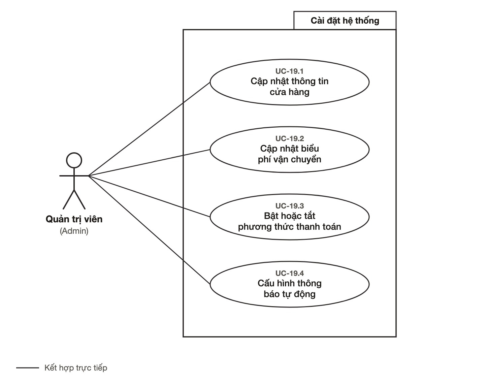

*Hình 2.19 — Cài đặt hệ thống. Tác nhân: Quản trị viên. 4 use case: UC-19.1 → UC-19.4. Ảnh vector: [`diagrams/uc-19-cai-dat.svg`](diagrams/uc-19-cai-dat.svg).*
<!-- uc:figures:end -->

## 6. Chức năng có trong đặc tả nhưng giao diện chưa có

`02_pages.md` mô tả một số chức năng mà giao diện hiện tại **chưa làm**, nên chưa được vẽ ở các hình trên. Khi giao diện bổ sung, thêm vào `use-case-data.mjs` (mục 9) để sơ đồ luôn đủ.

| Màn hình | Chức năng đặc tả chưa có | Nhóm sẽ thêm vào |
|---|---|---|
| SCR-22 | Kiểm tra tồn kho theo cửa hàng (chọn sản phẩm → bảng cửa hàng, tình trạng, số lượng) | Hình 2.1 |
| SCR-21 | Tab "Yêu cầu báo giá" (P2) | Hình 2.1 |
| SCR-16 | Tìm đơn theo mã đơn | Hình 2.5 |
| SCR-19 | Cài đặt thông báo email / SMS | Hình 2.9 |
| SCR-A02 | Lọc đơn theo thanh toán và theo khoảng ngày | Hình 2.10 |
| SCR-A07 | Điều chỉnh lô hàng | Hình 2.11 |
| SCR-A04 | Lọc sản phẩm theo trạng thái đang bán / ẩn | Hình 2.15 |
| SCR-A06 | Công tắc hiển thị danh mục | Hình 2.15 |
| SCR-A09 | Sửa voucher đã tạo | Hình 2.17 |

## 7. Các quan hệ

**«include» / «extend»** — mỗi dòng là một quan hệ đã vẽ ở hình phân rã tương ứng. Quy tắc dùng: *include* khi use case gốc **luôn** cần bước kia (đặt hàng luôn phải chọn vận chuyển); *extend* khi bước kia **tùy chọn** (áp mã giảm giá, in phiếu, lọc kết quả).

<!-- uc:relations:start -->
| Hình | Quan hệ | Use case nguồn | Use case đích |
|---|---|---|---|
| Hình 2.1 | «extend» | UC-1.2 Lọc cửa hàng theo khu vực | UC-1.1 Xem hệ thống cửa hàng |
| Hình 2.1 | «extend» | UC-1.3 Xem chỉ đường đến cửa hàng | UC-1.1 Xem hệ thống cửa hàng |
| Hình 2.1 | «extend» | UC-1.4 Gọi điện đến cửa hàng | UC-1.1 Xem hệ thống cửa hàng |
| Hình 2.1 | «extend» | UC-1.6 Xem câu hỏi thường gặp (FAQ) | UC-1.5 Xem trung tâm hỗ trợ và chính sách |
| Hình 2.2 | «include» | UC-2.1 Xem chi tiết sản phẩm | UC-2.3 Xem bảng giá sỉ bậc thang |
| Hình 2.2 | «include» | UC-2.1 Xem chi tiết sản phẩm | UC-2.5 Xem hạn dùng, số lô và tồn kho |
| Hình 2.2 | «include» | UC-2.1 Xem chi tiết sản phẩm | UC-2.6 Xem tình trạng hàng tại các cửa hàng |
| Hình 2.2 | «include» | UC-2.1 Xem chi tiết sản phẩm | UC-2.7 Xem mô tả, thành phần và thông số |
| Hình 2.2 | «include» | UC-2.1 Xem chi tiết sản phẩm | UC-2.8 Xem đánh giá của khách hàng |
| Hình 2.2 | «include» | UC-2.1 Xem chi tiết sản phẩm | UC-2.9 Xem món bánh phù hợp và sản phẩm liên quan |
| Hình 2.2 | «extend» | UC-2.2 Phóng to ảnh sản phẩm | UC-2.1 Xem chi tiết sản phẩm |
| Hình 2.2 | «extend» | UC-2.4 Chọn nhanh số lượng theo bậc giá | UC-2.3 Xem bảng giá sỉ bậc thang |
| Hình 2.3 | «extend» | UC-3.3 Lọc sản phẩm | UC-3.2 Duyệt sản phẩm theo danh mục |
| Hình 2.3 | «extend» | UC-3.4 Sắp xếp sản phẩm | UC-3.2 Duyệt sản phẩm theo danh mục |
| Hình 2.3 | «extend» | UC-3.5 Chuyển trang danh sách | UC-3.2 Duyệt sản phẩm theo danh mục |
| Hình 2.3 | «extend» | UC-3.7 Xem gợi ý tìm kiếm (Ctrl/⌘ + K) | UC-3.6 Tìm kiếm sản phẩm |
| Hình 2.3 | «extend» | UC-3.10 Chọn hoặc bỏ nguyên liệu trong combo | UC-3.9 Xem chi tiết combo và cách làm |
| Hình 2.3 | «extend» | UC-3.11 Thêm nguyên liệu đã chọn vào giỏ | UC-3.9 Xem chi tiết combo và cách làm |
| Hình 2.4 | «include» | UC-4.2 Đăng ký tài khoản khách lẻ | UC-4.4 Xác thực OTP |
| Hình 2.4 | «include» | UC-4.3 Đăng ký tài khoản doanh nghiệp (sỉ) | UC-4.4 Xác thực OTP |
| Hình 2.4 | «extend» | UC-4.5 Gửi lại mã OTP | UC-4.4 Xác thực OTP |
| Hình 2.5 | «include» | UC-5.1 Tra cứu đơn hàng bằng mã đơn và SĐT | UC-5.2 Xem hành trình đơn hàng |
| Hình 2.5 | «extend» | UC-5.3 Hủy đơn hàng | UC-5.2 Xem hành trình đơn hàng |
| Hình 2.5 | «extend» | UC-5.4 Mua lại đơn hàng | UC-5.2 Xem hành trình đơn hàng |
| Hình 2.5 | «extend» | UC-5.5 In hóa đơn | UC-5.2 Xem hành trình đơn hàng |
| Hình 2.5 | «extend» | UC-5.6 Tải hóa đơn điện tử (PDF) | UC-5.2 Xem hành trình đơn hàng |
| Hình 2.5 | «extend» | UC-5.8 Lọc đơn theo trạng thái | UC-5.7 Xem danh sách đơn hàng của tôi |
| Hình 2.6 | «include» | UC-6.2 Mua ngay | UC-6.1 Thêm sản phẩm vào giỏ |
| Hình 2.6 | «extend» | UC-6.4 Đổi số lượng sản phẩm trong giỏ | UC-6.3 Xem giỏ hàng |
| Hình 2.6 | «extend» | UC-6.5 Xóa sản phẩm khỏi giỏ | UC-6.3 Xem giỏ hàng |
| Hình 2.6 | «extend» | UC-6.6 Xóa toàn bộ giỏ hàng | UC-6.3 Xem giỏ hàng |
| Hình 2.6 | «extend» | UC-6.7 Áp dụng mã giảm giá | UC-6.3 Xem giỏ hàng |
| Hình 2.6 | «extend» | UC-6.8 Bỏ mã giảm giá | UC-6.7 Áp dụng mã giảm giá |
| Hình 2.7 | «include» | UC-7.1 Đặt hàng | UC-7.2 Chọn hình thức nhận hàng |
| Hình 2.7 | «include» | UC-7.1 Đặt hàng | UC-7.3 Chọn hoặc nhập địa chỉ nhận hàng |
| Hình 2.7 | «include» | UC-7.1 Đặt hàng | UC-7.4 Chọn phương thức vận chuyển |
| Hình 2.7 | «include» | UC-7.1 Đặt hàng | UC-7.5 Chọn phương thức thanh toán |
| Hình 2.7 | «include» | UC-7.1 Đặt hàng | UC-7.8 Xem xác nhận đặt hàng thành công |
| Hình 2.7 | «extend» | UC-7.6 Thanh toán bằng mã QR VNPay | UC-7.5 Chọn phương thức thanh toán |
| Hình 2.7 | «extend» | UC-7.7 Yêu cầu xuất hóa đơn VAT | UC-7.1 Đặt hàng |
| Hình 2.7 | «extend» | UC-7.9 In phiếu đơn hàng | UC-7.8 Xem xác nhận đặt hàng thành công |
| Hình 2.7 | «extend» | UC-7.10 Xuất VAT bằng thông tin doanh nghiệp điền sẵn | UC-7.7 Yêu cầu xuất hóa đơn VAT |
| Hình 2.9 | «extend» | UC-9.3 Thêm địa chỉ mới | UC-9.2 Xem sổ địa chỉ |
| Hình 2.9 | «extend» | UC-9.4 Sửa địa chỉ | UC-9.2 Xem sổ địa chỉ |
| Hình 2.9 | «extend» | UC-9.5 Xóa địa chỉ | UC-9.2 Xem sổ địa chỉ |
| Hình 2.9 | «extend» | UC-9.6 Đặt địa chỉ mặc định | UC-9.2 Xem sổ địa chỉ |
| Hình 2.9 | «extend» | UC-9.10 Cập nhật thông tin xuất hóa đơn VAT | UC-9.9 Xem hồ sơ doanh nghiệp |
| Hình 2.10 | «extend» | UC-10.2 Lọc đơn theo trạng thái | UC-10.1 Xem danh sách đơn hàng |
| Hình 2.10 | «extend» | UC-10.3 Lọc đơn theo hình thức vận chuyển | UC-10.1 Xem danh sách đơn hàng |
| Hình 2.10 | «extend» | UC-10.4 Tìm kiếm đơn hàng | UC-10.1 Xem danh sách đơn hàng |
| Hình 2.10 | «extend» | UC-10.5 Duyệt hàng loạt các đơn đã chọn | UC-10.1 Xem danh sách đơn hàng |
| Hình 2.10 | «extend» | UC-10.6 Xuất danh sách đơn ra CSV | UC-10.1 Xem danh sách đơn hàng |
| Hình 2.10 | «include» | UC-10.7 Xem chi tiết đơn hàng | UC-10.12 Xem lịch sử trạng thái của đơn |
| Hình 2.10 | «extend» | UC-10.8 Cập nhật trạng thái xử lý đơn | UC-10.7 Xem chi tiết đơn hàng |
| Hình 2.10 | «extend» | UC-10.9 Kiểm tra checklist đóng gói lạnh | UC-10.7 Xem chi tiết đơn hàng |
| Hình 2.10 | «extend» | UC-10.10 In phiếu xuất kho | UC-10.7 Xem chi tiết đơn hàng |
| Hình 2.10 | «extend» | UC-10.11 In hóa đơn VAT | UC-10.7 Xem chi tiết đơn hàng |
| Hình 2.11 | «include» | UC-11.1 Xem tồn kho theo sản phẩm | UC-11.6 Cảnh báo sản phẩm tồn kho thấp |
| Hình 2.11 | «extend» | UC-11.2 Sửa nhanh số lượng tồn kho | UC-11.1 Xem tồn kho theo sản phẩm |
| Hình 2.11 | «extend» | UC-11.3 Tạo phiếu nhập kho | UC-11.1 Xem tồn kho theo sản phẩm |
| Hình 2.11 | «include» | UC-11.4 Xem lô hàng và hạn dùng (FEFO) | UC-11.7 Cảnh báo lô sắp hết hạn |
| Hình 2.12 | «include» | UC-12.1 Xem chuyến giao hôm nay | UC-12.2 Xem nhiệt độ thùng xe lạnh |
| Hình 2.12 | «extend» | UC-12.3 Định vị GPS xe giao hàng | UC-12.1 Xem chuyến giao hôm nay |
| Hình 2.12 | «extend» | UC-12.4 Xuất báo cáo chuyến xe ra CSV | UC-12.1 Xem chuyến giao hôm nay |
| Hình 2.13 | «include» | UC-13.1 Xem chỉ số kinh doanh | UC-13.3 Xem biểu đồ doanh thu theo ngày |
| Hình 2.13 | «include» | UC-13.1 Xem chỉ số kinh doanh | UC-13.4 Xem đơn hàng theo trạng thái |
| Hình 2.13 | «include» | UC-13.1 Xem chỉ số kinh doanh | UC-13.5 Xem cảnh báo kho và lô sắp hết hạn |
| Hình 2.13 | «include» | UC-13.1 Xem chỉ số kinh doanh | UC-13.6 Xem chuyến xe lạnh đang giao |
| Hình 2.13 | «extend» | UC-13.2 Chọn kỳ thống kê 7 hoặc 30 ngày | UC-13.1 Xem chỉ số kinh doanh |
| Hình 2.13 | «extend» | UC-13.7 Xử lý nhanh đơn cần xử lý | UC-13.1 Xem chỉ số kinh doanh |
| Hình 2.14 | «extend» | UC-14.2 Xem top 10 sản phẩm bán chạy | UC-14.1 Xem báo cáo doanh thu theo thời gian |
| Hình 2.14 | «extend» | UC-14.3 Xem phân khúc khách hàng lẻ và sỉ | UC-14.1 Xem báo cáo doanh thu theo thời gian |
| Hình 2.14 | «extend» | UC-14.4 Chọn kỳ báo cáo 7 hoặc 30 ngày | UC-14.1 Xem báo cáo doanh thu theo thời gian |
| Hình 2.14 | «extend» | UC-14.5 Xuất báo cáo ra CSV | UC-14.1 Xem báo cáo doanh thu theo thời gian |
| Hình 2.15 | «extend» | UC-15.2 Tìm và lọc sản phẩm | UC-15.1 Xem danh sách sản phẩm |
| Hình 2.15 | «extend» | UC-15.3 Ẩn hoặc mở bán lại sản phẩm | UC-15.1 Xem danh sách sản phẩm |
| Hình 2.15 | «extend» | UC-15.4 Xóa sản phẩm | UC-15.1 Xem danh sách sản phẩm |
| Hình 2.15 | «extend» | UC-15.7 Thiết lập bảng giá sỉ bậc thang | UC-15.5 Thêm sản phẩm mới |
| Hình 2.15 | «extend» | UC-15.7 Thiết lập bảng giá sỉ bậc thang | UC-15.6 Sửa thông tin sản phẩm |
| Hình 2.15 | «extend» | UC-15.9 Thêm danh mục | UC-15.8 Xem danh sách danh mục |
| Hình 2.15 | «extend» | UC-15.10 Sửa danh mục | UC-15.8 Xem danh sách danh mục |
| Hình 2.15 | «extend» | UC-15.11 Xóa danh mục | UC-15.8 Xem danh sách danh mục |
| Hình 2.16 | «extend» | UC-16.2 Lọc khách hàng (tất cả, sỉ, chờ duyệt) | UC-16.1 Xem danh sách khách hàng |
| Hình 2.16 | «extend» | UC-16.3 Xuất danh sách khách hàng ra CSV | UC-16.1 Xem danh sách khách hàng |
| Hình 2.16 | «extend» | UC-16.4 Xem hồ sơ doanh nghiệp và giấy phép | UC-16.1 Xem danh sách khách hàng |
| Hình 2.16 | «extend» | UC-16.5 Duyệt tài khoản khách sỉ | UC-16.4 Xem hồ sơ doanh nghiệp và giấy phép |
| Hình 2.16 | «extend» | UC-16.6 Từ chối yêu cầu đăng ký sỉ | UC-16.4 Xem hồ sơ doanh nghiệp và giấy phép |
| Hình 2.17 | «extend» | UC-17.2 Lọc voucher theo loại | UC-17.1 Xem danh sách voucher |
| Hình 2.17 | «extend» | UC-17.3 Tạo voucher mới | UC-17.1 Xem danh sách voucher |
| Hình 2.17 | «extend» | UC-17.4 Bật hoặc tạm dừng voucher | UC-17.1 Xem danh sách voucher |
| Hình 2.17 | «extend» | UC-17.5 Xóa voucher | UC-17.1 Xem danh sách voucher |
| Hình 2.18 | «extend» | UC-18.2 Lọc nhân sự theo vai trò | UC-18.1 Xem danh sách nhân sự |
| Hình 2.18 | «extend» | UC-18.3 Mời nhân viên mới | UC-18.1 Xem danh sách nhân sự |
| Hình 2.18 | «extend» | UC-18.4 Chỉnh sửa tài khoản nhân viên | UC-18.1 Xem danh sách nhân sự |
| Hình 2.18 | «extend» | UC-18.6 Cập nhật quyền theo vai trò | UC-18.5 Xem ma trận phân quyền |
<!-- uc:relations:end -->

**Kế thừa giữa tác nhân:**

| Tác nhân con | Tác nhân cha | Vì sao |
|---|---|---|
| Khách hàng lẻ | Khách vãng lai | Khách đã đăng nhập làm được mọi việc của khách chưa đăng nhập |
| Khách hàng sỉ | Khách hàng lẻ | Khách sỉ là khách lẻ có thêm giá sỉ và hồ sơ doanh nghiệp |
| Quản trị viên | Nhân viên kho và vận hành | Quản trị viên làm được mọi việc của nhân viên |

## 8. Danh mục use case

Cột **Màn hình** nối use case với mã `SCR-xx` trong `02_pages.md`; cột **Yêu cầu** nối với ma trận trong `src/data/swrRequirements.ts`. Ô ghi *đề xuất FR mới* là chức năng chưa có yêu cầu tương ứng trong ma trận — nhóm quyết định có thêm vào SRS hay không (Antigravity không tự sửa SRS). Use case ghi *(qua use case gốc)* do tác nhân của use case gốc thực hiện.

<!-- uc:catalogue:start -->
| Mã | Use case | Tác nhân | Màn hình | Yêu cầu | Ghi chú |
|---|---|---|---|---|---|
| UC-1.1 | Xem hệ thống cửa hàng | Khách vãng lai | SCR-22 | đề xuất FR mới |  |
| UC-1.2 | Lọc cửa hàng theo khu vực | Khách vãng lai *(qua use case gốc)* | SCR-22 | đề xuất FR mới |  |
| UC-1.3 | Xem chỉ đường đến cửa hàng | Khách vãng lai *(qua use case gốc)* | SCR-22 | đề xuất FR mới | Mở Google Maps ở tab mới |
| UC-1.4 | Gọi điện đến cửa hàng | Khách vãng lai *(qua use case gốc)* | SCR-22 | đề xuất FR mới |  |
| UC-1.5 | Xem trung tâm hỗ trợ và chính sách | Khách vãng lai | SCR-23 | đề xuất FR mới |  |
| UC-1.6 | Xem câu hỏi thường gặp (FAQ) | Khách vãng lai *(qua use case gốc)* | SCR-23 | đề xuất FR mới |  |
| UC-1.7 | Xem giới thiệu công ty | Khách vãng lai | SCR-24 | đề xuất FR mới |  |
| UC-1.8 | Gửi liên hệ, góp ý | Khách vãng lai | SCR-24 | đề xuất FR mới |  |
| UC-1.9 | Xem quyền lợi và bảng chiết khấu mua sỉ | Khách vãng lai | SCR-21 | BR-RULE-02 |  |
| UC-1.10 | Gửi yêu cầu đăng ký đại lý mua sỉ | Khách vãng lai | SCR-21 | BR-RULE-02, đề xuất FR mới | Phản hồi trong 24 giờ làm việc (nội dung mô phỏng) |
| UC-2.1 | Xem chi tiết sản phẩm | Khách vãng lai | SCR-04 | FR-PROD-03 |  |
| UC-2.2 | Phóng to ảnh sản phẩm | Khách vãng lai *(qua use case gốc)* | SCR-04 | FR-PROD-03 |  |
| UC-2.3 | Xem bảng giá sỉ bậc thang | Khách vãng lai *(qua use case gốc)* | SCR-04 | FR-PROD-03, BR-RULE-02 | Dòng ứng với số lượng đang chọn được tô nổi |
| UC-2.4 | Chọn nhanh số lượng theo bậc giá | Khách vãng lai *(qua use case gốc)* | SCR-04 | BR-RULE-02 |  |
| UC-2.5 | Xem hạn dùng, số lô và tồn kho | Khách vãng lai *(qua use case gốc)* | SCR-04 | FR-PROD-03, BR-RULE-01 | Hàng cần lạnh hiện ghi chú bảo quản 2–8°C và giao xe lạnh |
| UC-2.6 | Xem tình trạng hàng tại các cửa hàng | Khách vãng lai *(qua use case gốc)* | SCR-04 | FR-PROD-03 |  |
| UC-2.7 | Xem mô tả, thành phần và thông số | Khách vãng lai *(qua use case gốc)* | SCR-04 | FR-PROD-03 | Các tab Mô tả, Thành phần, Bảo quản và sử dụng, Thông số kỹ thuật |
| UC-2.8 | Xem đánh giá của khách hàng | Khách vãng lai *(qua use case gốc)* | SCR-04 | FR-PROD-03 | Tab Đánh giá |
| UC-2.9 | Xem món bánh phù hợp và sản phẩm liên quan | Khách vãng lai *(qua use case gốc)* | SCR-04 | FR-PROD-03 |  |
| UC-3.1 | Xem trang chủ | Khách vãng lai | SCR-01 | FR-SRC-01, FR-KIT-04 |  |
| UC-3.2 | Duyệt sản phẩm theo danh mục | Khách vãng lai | SCR-02 | FR-FIL-02 |  |
| UC-3.3 | Lọc sản phẩm | Khách vãng lai *(qua use case gốc)* | SCR-02 | FR-FIL-02 | Danh mục, điều kiện bảo quản, thương hiệu, khoảng giá, còn hàng; gỡ từng lọc hoặc xóa tất cả |
| UC-3.4 | Sắp xếp sản phẩm | Khách vãng lai *(qua use case gốc)* | SCR-02 | FR-FIL-02 |  |
| UC-3.5 | Chuyển trang danh sách | Khách vãng lai *(qua use case gốc)* | SCR-02 | FR-SRC-01 |  |
| UC-3.6 | Tìm kiếm sản phẩm | Khách vãng lai | SCR-03 | FR-SRC-01 | Theo tên, thương hiệu, SKU, danh mục; ô tìm kiếm ở đầu trang |
| UC-3.7 | Xem gợi ý tìm kiếm (Ctrl/⌘ + K) | Khách vãng lai *(qua use case gốc)* | SCR-03 | FR-SRC-01 |  |
| UC-3.8 | Xem danh sách combo công thức | Khách vãng lai | SCR-05 | FR-KIT-04 |  |
| UC-3.9 | Xem chi tiết combo và cách làm | Khách vãng lai | SCR-06 | FR-KIT-04 |  |
| UC-3.10 | Chọn hoặc bỏ nguyên liệu trong combo | Khách vãng lai *(qua use case gốc)* | SCR-06 | FR-KIT-04 |  |
| UC-3.11 | Thêm nguyên liệu đã chọn vào giỏ | Khách hàng lẻ | SCR-06 | FR-KIT-04, FR-CART-05 |  |
| UC-4.1 | Đăng nhập | Nhân viên kho và vận hành, Khách vãng lai | SCR-12 | FR-AUTH-01 | Mọi vai trò dùng chung một màn hình đăng nhập |
| UC-4.2 | Đăng ký tài khoản khách lẻ | Khách vãng lai | SCR-13 | FR-AUTH-01 |  |
| UC-4.3 | Đăng ký tài khoản doanh nghiệp (sỉ) | Khách vãng lai | SCR-13 | FR-AUTH-01 | Nhập thêm tên doanh nghiệp và mã số thuế; chờ quản trị viên duyệt |
| UC-4.4 | Xác thực OTP | Khách vãng lai *(qua use case gốc)* | SCR-13 (bước 2) | FR-AUTH-01 |  |
| UC-4.5 | Gửi lại mã OTP | Khách vãng lai *(qua use case gốc)* | SCR-13 (bước 2) | FR-AUTH-01 |  |
| UC-4.6 | Quên mật khẩu | Khách vãng lai | SCR-14 | đề xuất FR mới | Gửi liên kết đặt lại qua email, không có OTP |
| UC-4.7 | Đăng xuất | Khách hàng lẻ | Menu tài khoản ở đầu trang | đề xuất FR mới |  |
| UC-5.1 | Tra cứu đơn hàng bằng mã đơn và SĐT | Khách vãng lai | SCR-10 | FR-TRK-07 |  |
| UC-5.2 | Xem hành trình đơn hàng | Khách hàng lẻ | SCR-11 | FR-TRK-07 | 5 mốc xử lý, tài xế, xe và nhiệt độ thùng lạnh; vào từ danh sách đơn hoặc trang đặt hàng thành công |
| UC-5.3 | Hủy đơn hàng | Khách hàng lẻ *(qua use case gốc)* | SCR-11, SCR-16 | FR-TRK-07 | Khi đơn chờ xác nhận hoặc đã xác nhận |
| UC-5.4 | Mua lại đơn hàng | Khách hàng lẻ *(qua use case gốc)* | SCR-11, SCR-16 | FR-TRK-07 |  |
| UC-5.5 | In hóa đơn | Khách hàng lẻ *(qua use case gốc)* | SCR-11 | FR-TRK-07 |  |
| UC-5.6 | Tải hóa đơn điện tử (PDF) | Khách hàng lẻ *(qua use case gốc)* | SCR-11 | FR-TRK-07 | Đơn có yêu cầu hóa đơn VAT |
| UC-5.7 | Xem danh sách đơn hàng của tôi | Khách hàng lẻ | SCR-16 | FR-TRK-07 |  |
| UC-5.8 | Lọc đơn theo trạng thái | Khách hàng lẻ *(qua use case gốc)* | SCR-16 | FR-TRK-07 |  |
| UC-6.1 | Thêm sản phẩm vào giỏ | Khách hàng lẻ | SCR-02, SCR-04, SCR-18, giỏ mini | FR-CART-05 | Từ thẻ sản phẩm, trang chi tiết, danh sách yêu thích |
| UC-6.2 | Mua ngay | Khách hàng lẻ | SCR-04 | FR-CART-05 | Thêm vào giỏ rồi chuyển thẳng sang thanh toán |
| UC-6.3 | Xem giỏ hàng | Khách hàng lẻ | SCR-07, giỏ mini | FR-CART-05, BR-RULE-01, BR-RULE-02 | Hiện tiến độ miễn phí vận chuyển và gợi ý bậc giá kế tiếp |
| UC-6.4 | Đổi số lượng sản phẩm trong giỏ | Khách hàng lẻ *(qua use case gốc)* | SCR-07 | FR-CART-05 |  |
| UC-6.5 | Xóa sản phẩm khỏi giỏ | Khách hàng lẻ *(qua use case gốc)* | SCR-07, giỏ mini | FR-CART-05 |  |
| UC-6.6 | Xóa toàn bộ giỏ hàng | Khách hàng lẻ *(qua use case gốc)* | SCR-07 | FR-CART-05 |  |
| UC-6.7 | Áp dụng mã giảm giá | Khách hàng lẻ *(qua use case gốc)* | SCR-07 | FR-CART-05 | BAKING2026, GHPVIP, FREESHIP |
| UC-6.8 | Bỏ mã giảm giá | Khách hàng lẻ *(qua use case gốc)* | SCR-07 | FR-CART-05 |  |
| UC-7.1 | Đặt hàng | Khách hàng lẻ | SCR-08 | FR-CHK-06 | Thanh toán 3 bước: nhận hàng, vận chuyển, thanh toán |
| UC-7.2 | Chọn hình thức nhận hàng | Khách hàng lẻ *(qua use case gốc)* | SCR-08 (bước 1) | FR-CHK-06 | Giao tận nơi hoặc nhận tại cửa hàng |
| UC-7.3 | Chọn hoặc nhập địa chỉ nhận hàng | Khách hàng lẻ *(qua use case gốc)* | SCR-08 (bước 1) | FR-CHK-06 |  |
| UC-7.4 | Chọn phương thức vận chuyển | Khách hàng lẻ *(qua use case gốc)* | SCR-08 (bước 2) | FR-CHK-06, BR-RULE-01 | Giao tiêu chuẩn 25.000₫ hoặc xe lạnh 45.000₫ |
| UC-7.5 | Chọn phương thức thanh toán | Khách hàng lẻ *(qua use case gốc)* | SCR-08 (bước 3) | FR-CHK-06 | VNPay QR, MoMo, chuyển khoản, COD |
| UC-7.6 | Thanh toán bằng mã QR VNPay | Khách hàng lẻ *(qua use case gốc)* | SCR-08 (bước 3) | FR-CHK-06 |  |
| UC-7.7 | Yêu cầu xuất hóa đơn VAT | Khách hàng lẻ, Khách hàng sỉ *(qua use case gốc)* | SCR-08 (bước 1) | FR-CHK-06 | Khách sỉ được gợi ý bật sẵn |
| UC-7.8 | Xem xác nhận đặt hàng thành công | Khách hàng lẻ *(qua use case gốc)* | SCR-09 | FR-CHK-06 |  |
| UC-7.9 | In phiếu đơn hàng | Khách hàng lẻ *(qua use case gốc)* | SCR-09 | FR-CHK-06 |  |
| UC-7.10 | Xuất VAT bằng thông tin doanh nghiệp điền sẵn | Khách hàng sỉ | SCR-08 (bước 1) | FR-CHK-06 | Khách sỉ: hóa đơn VAT bật sẵn, tự điền mã số thuế, tên và địa chỉ công ty |
| UC-8.1 | Xem sản phẩm yêu thích | Khách hàng lẻ | SCR-18 | đề xuất FR mới |  |
| UC-8.2 | Thêm sản phẩm vào yêu thích | Khách hàng lẻ | SCR-02, SCR-04 | đề xuất FR mới | Nút ♡ ở thẻ sản phẩm và trang chi tiết |
| UC-8.3 | Bỏ sản phẩm khỏi yêu thích | Khách hàng lẻ | SCR-18, SCR-04 | đề xuất FR mới |  |
| UC-8.4 | Viết đánh giá sản phẩm | Khách hàng lẻ | SCR-04 (tab Đánh giá) | đề xuất FR mới | Chấm sao và viết nhận xét |
| UC-9.1 | Xem tổng quan tài khoản | Khách hàng lẻ | SCR-15 | đề xuất FR mới |  |
| UC-9.2 | Xem sổ địa chỉ | Khách hàng lẻ | SCR-17 | đề xuất FR mới |  |
| UC-9.3 | Thêm địa chỉ mới | Khách hàng lẻ *(qua use case gốc)* | SCR-17 | đề xuất FR mới |  |
| UC-9.4 | Sửa địa chỉ | Khách hàng lẻ *(qua use case gốc)* | SCR-17 | đề xuất FR mới |  |
| UC-9.5 | Xóa địa chỉ | Khách hàng lẻ *(qua use case gốc)* | SCR-17 | đề xuất FR mới |  |
| UC-9.6 | Đặt địa chỉ mặc định | Khách hàng lẻ *(qua use case gốc)* | SCR-17 | đề xuất FR mới |  |
| UC-9.7 | Cập nhật thông tin cá nhân | Khách hàng lẻ | SCR-19 | đề xuất FR mới |  |
| UC-9.8 | Đổi mật khẩu | Khách hàng lẻ | SCR-19 | đề xuất FR mới |  |
| UC-9.9 | Xem hồ sơ doanh nghiệp | Khách hàng sỉ | SCR-20 | BR-RULE-02, đề xuất FR mới |  |
| UC-9.10 | Cập nhật thông tin xuất hóa đơn VAT | Khách hàng sỉ *(qua use case gốc)* | SCR-20 | đề xuất FR mới |  |
| UC-9.11 | Xem bảng chiết khấu của tôi | Khách hàng sỉ | SCR-15, SCR-20 | BR-RULE-02 |  |
| UC-9.12 | Xem hạn mức công nợ | Khách hàng sỉ | SCR-15 | đề xuất FR mới | Hiện trong thẻ đại lý ở tổng quan tài khoản |
| UC-10.1 | Xem danh sách đơn hàng | Nhân viên kho và vận hành | SCR-A02 | FR-ADM-08 |  |
| UC-10.2 | Lọc đơn theo trạng thái | Nhân viên kho và vận hành *(qua use case gốc)* | SCR-A02 | FR-ADM-08 |  |
| UC-10.3 | Lọc đơn theo hình thức vận chuyển | Nhân viên kho và vận hành *(qua use case gốc)* | SCR-A02 | FR-ADM-08 |  |
| UC-10.4 | Tìm kiếm đơn hàng | Nhân viên kho và vận hành *(qua use case gốc)* | SCR-A02 | FR-ADM-08 |  |
| UC-10.5 | Duyệt hàng loạt các đơn đã chọn | Nhân viên kho và vận hành *(qua use case gốc)* | SCR-A02 | FR-ADM-08 |  |
| UC-10.6 | Xuất danh sách đơn ra CSV | Nhân viên kho và vận hành *(qua use case gốc)* | SCR-A02 | FR-ADM-08 |  |
| UC-10.7 | Xem chi tiết đơn hàng | Nhân viên kho và vận hành | SCR-A03 | FR-ADM-08 |  |
| UC-10.8 | Cập nhật trạng thái xử lý đơn | Nhân viên kho và vận hành *(qua use case gốc)* | SCR-A03 | FR-ADM-08 | Xác nhận → đóng gói → bàn giao xe lạnh → hoàn tất |
| UC-10.9 | Kiểm tra checklist đóng gói lạnh | Nhân viên kho và vận hành *(qua use case gốc)* | SCR-A03 | FR-ADM-08, BR-RULE-01 | Thùng xốp, đá gel, nhiệt kế |
| UC-10.10 | In phiếu xuất kho | Nhân viên kho và vận hành *(qua use case gốc)* | SCR-A03 | FR-ADM-08 |  |
| UC-10.11 | In hóa đơn VAT | Nhân viên kho và vận hành *(qua use case gốc)* | SCR-A03 | FR-ADM-08 |  |
| UC-10.12 | Xem lịch sử trạng thái của đơn | Nhân viên kho và vận hành *(qua use case gốc)* | SCR-A03 | FR-ADM-08 |  |
| UC-11.1 | Xem tồn kho theo sản phẩm | Nhân viên kho và vận hành | SCR-A07 | FR-ADM-08 |  |
| UC-11.2 | Sửa nhanh số lượng tồn kho | Nhân viên kho và vận hành *(qua use case gốc)* | SCR-A07 | FR-ADM-08 |  |
| UC-11.3 | Tạo phiếu nhập kho | Nhân viên kho và vận hành *(qua use case gốc)* | SCR-A07 | FR-ADM-08 |  |
| UC-11.4 | Xem lô hàng và hạn dùng (FEFO) | Nhân viên kho và vận hành | SCR-A07 | FR-ADM-08 | Hết hạn trước, xuất trước |
| UC-11.5 | Xem nhật ký nhập xuất | Nhân viên kho và vận hành | SCR-A07 | FR-ADM-08 |  |
| UC-11.6 | Cảnh báo sản phẩm tồn kho thấp | Nhân viên kho và vận hành *(qua use case gốc)* | SCR-A07, SCR-A01 | FR-ADM-08 |  |
| UC-11.7 | Cảnh báo lô sắp hết hạn | Nhân viên kho và vận hành *(qua use case gốc)* | SCR-A07, SCR-A01 | FR-ADM-08 | Còn ≤ 30 ngày; ≤ 7 ngày làm nổi hơn |
| UC-12.1 | Xem chuyến giao hôm nay | Nhân viên kho và vận hành | SCR-A10 | FR-ADM-08, BR-RULE-01 |  |
| UC-12.2 | Xem nhiệt độ thùng xe lạnh | Nhân viên kho và vận hành *(qua use case gốc)* | SCR-A10 | FR-ADM-08, BR-RULE-01 | Cảnh báo khi vượt 8°C |
| UC-12.3 | Định vị GPS xe giao hàng | Nhân viên kho và vận hành *(qua use case gốc)* | SCR-A10 | FR-ADM-08, BR-RULE-01 |  |
| UC-12.4 | Xuất báo cáo chuyến xe ra CSV | Nhân viên kho và vận hành *(qua use case gốc)* | SCR-A10 | FR-ADM-08, BR-RULE-01 |  |
| UC-12.5 | Xem nhật ký nhiệt độ | Nhân viên kho và vận hành | SCR-A10 | FR-ADM-08, BR-RULE-01 |  |
| UC-12.6 | Xem biểu phí và ngưỡng miễn phí | Nhân viên kho và vận hành | SCR-A10 | FR-ADM-08, BR-RULE-01 |  |
| UC-13.1 | Xem chỉ số kinh doanh | Quản trị viên | SCR-A01 | FR-ADM-08 | Doanh thu, đơn hàng, đơn cần xử lý, cảnh báo kho và HSD |
| UC-13.2 | Chọn kỳ thống kê 7 hoặc 30 ngày | Quản trị viên *(qua use case gốc)* | SCR-A01 | FR-ADM-08 |  |
| UC-13.3 | Xem biểu đồ doanh thu theo ngày | Quản trị viên *(qua use case gốc)* | SCR-A01 | FR-ADM-08 |  |
| UC-13.4 | Xem đơn hàng theo trạng thái | Quản trị viên *(qua use case gốc)* | SCR-A01 | FR-ADM-08 |  |
| UC-13.5 | Xem cảnh báo kho và lô sắp hết hạn | Quản trị viên *(qua use case gốc)* | SCR-A01 | FR-ADM-08 |  |
| UC-13.6 | Xem chuyến xe lạnh đang giao | Quản trị viên *(qua use case gốc)* | SCR-A01 | FR-ADM-08 |  |
| UC-13.7 | Xử lý nhanh đơn cần xử lý | Quản trị viên *(qua use case gốc)* | SCR-A01 | FR-ADM-08 | Mở chi tiết đơn hàng |
| UC-14.1 | Xem báo cáo doanh thu theo thời gian | Quản trị viên | SCR-A11 | đề xuất FR mới |  |
| UC-14.2 | Xem top 10 sản phẩm bán chạy | Quản trị viên *(qua use case gốc)* | SCR-A11 | đề xuất FR mới |  |
| UC-14.3 | Xem phân khúc khách hàng lẻ và sỉ | Quản trị viên *(qua use case gốc)* | SCR-A11 | đề xuất FR mới |  |
| UC-14.4 | Chọn kỳ báo cáo 7 hoặc 30 ngày | Quản trị viên *(qua use case gốc)* | SCR-A11 | đề xuất FR mới |  |
| UC-14.5 | Xuất báo cáo ra CSV | Quản trị viên *(qua use case gốc)* | SCR-A11 | đề xuất FR mới |  |
| UC-15.1 | Xem danh sách sản phẩm | Quản trị viên | SCR-A04 | FR-ADM-08 |  |
| UC-15.2 | Tìm và lọc sản phẩm | Quản trị viên *(qua use case gốc)* | SCR-A04 | FR-ADM-08 | Danh mục, điều kiện bảo quản, tồn kho thấp |
| UC-15.3 | Ẩn hoặc mở bán lại sản phẩm | Quản trị viên *(qua use case gốc)* | SCR-A04 | FR-ADM-08 |  |
| UC-15.4 | Xóa sản phẩm | Quản trị viên *(qua use case gốc)* | SCR-A04 | FR-ADM-08 | Có hộp thoại xác nhận |
| UC-15.5 | Thêm sản phẩm mới | Quản trị viên | SCR-A05 | FR-ADM-08 |  |
| UC-15.6 | Sửa thông tin sản phẩm | Quản trị viên | SCR-A05 | FR-ADM-08 |  |
| UC-15.7 | Thiết lập bảng giá sỉ bậc thang | Quản trị viên *(qua use case gốc)* | SCR-A05 | FR-ADM-08, BR-RULE-02 |  |
| UC-15.8 | Xem danh sách danh mục | Quản trị viên | SCR-A06 | FR-ADM-08 |  |
| UC-15.9 | Thêm danh mục | Quản trị viên *(qua use case gốc)* | SCR-A06 | FR-ADM-08 |  |
| UC-15.10 | Sửa danh mục | Quản trị viên *(qua use case gốc)* | SCR-A06 | FR-ADM-08 |  |
| UC-15.11 | Xóa danh mục | Quản trị viên *(qua use case gốc)* | SCR-A06 | FR-ADM-08 |  |
| UC-16.1 | Xem danh sách khách hàng | Quản trị viên | SCR-A08 | đề xuất FR mới |  |
| UC-16.2 | Lọc khách hàng (tất cả, sỉ, chờ duyệt) | Quản trị viên *(qua use case gốc)* | SCR-A08 | đề xuất FR mới |  |
| UC-16.3 | Xuất danh sách khách hàng ra CSV | Quản trị viên *(qua use case gốc)* | SCR-A08 | đề xuất FR mới |  |
| UC-16.4 | Xem hồ sơ doanh nghiệp và giấy phép | Quản trị viên *(qua use case gốc)* | SCR-A08 | đề xuất FR mới |  |
| UC-16.5 | Duyệt tài khoản khách sỉ | Quản trị viên *(qua use case gốc)* | SCR-A08 | BR-RULE-02, đề xuất FR mới |  |
| UC-16.6 | Từ chối yêu cầu đăng ký sỉ | Quản trị viên *(qua use case gốc)* | SCR-A08 | đề xuất FR mới |  |
| UC-17.1 | Xem danh sách voucher | Quản trị viên | SCR-A09 | đề xuất FR mới |  |
| UC-17.2 | Lọc voucher theo loại | Quản trị viên *(qua use case gốc)* | SCR-A09 | đề xuất FR mới | Giảm cố định, giảm phần trăm, miễn phí vận chuyển |
| UC-17.3 | Tạo voucher mới | Quản trị viên *(qua use case gốc)* | SCR-A09 | đề xuất FR mới |  |
| UC-17.4 | Bật hoặc tạm dừng voucher | Quản trị viên *(qua use case gốc)* | SCR-A09 | đề xuất FR mới |  |
| UC-17.5 | Xóa voucher | Quản trị viên *(qua use case gốc)* | SCR-A09 | đề xuất FR mới |  |
| UC-18.1 | Xem danh sách nhân sự | Quản trị viên | SCR-A12 | đề xuất FR mới |  |
| UC-18.2 | Lọc nhân sự theo vai trò | Quản trị viên *(qua use case gốc)* | SCR-A12 | đề xuất FR mới |  |
| UC-18.3 | Mời nhân viên mới | Quản trị viên *(qua use case gốc)* | SCR-A12 | đề xuất FR mới | Gửi lời mời kích hoạt qua email |
| UC-18.4 | Chỉnh sửa tài khoản nhân viên | Quản trị viên *(qua use case gốc)* | SCR-A12 | đề xuất FR mới |  |
| UC-18.5 | Xem ma trận phân quyền | Quản trị viên | SCR-A12 | đề xuất FR mới |  |
| UC-18.6 | Cập nhật quyền theo vai trò | Quản trị viên *(qua use case gốc)* | SCR-A12 | đề xuất FR mới |  |
| UC-19.1 | Cập nhật thông tin cửa hàng | Quản trị viên | SCR-A13 | đề xuất FR mới |  |
| UC-19.2 | Cập nhật biểu phí vận chuyển | Quản trị viên | SCR-A13 | đề xuất FR mới | Phí giao tiêu chuẩn, xe lạnh, ngưỡng miễn phí |
| UC-19.3 | Bật hoặc tắt phương thức thanh toán | Quản trị viên | SCR-A13 | đề xuất FR mới | VNPay QR, MoMo, chuyển khoản, COD |
| UC-19.4 | Cấu hình thông báo tự động | Quản trị viên | SCR-A13 | đề xuất FR mới | Email xác nhận, thông báo giao hàng, cảnh báo nhiệt, báo cáo tuần |
<!-- uc:catalogue:end -->

## 9. Sửa và xuất lại sơ đồ

Mọi file trong `diagrams/` sinh ra từ **hai file**: `use-case-data.mjs` (dữ liệu) và `build-use-cases.mjs` (bố trí + vẽ). Không cần cài thêm gói nào (cần Node ≥ 22 và Google Chrome để xuất PNG).

```bash
cd client
node ui-spec/diagrams/build-use-cases.mjs             # vẽ lại: uc-*.svg + uc-*.png (nét x2)
node ui-spec/diagrams/build-use-cases.mjs --write-doc # cập nhật các bảng và hình trong file này
```

- **Thêm một chức năng:** thêm một dòng `u(...)` vào nhóm tương ứng trong `use-case-data.mjs` (tên, tác nhân, màn hình; use case phụ thì để tác nhân `null` và khai báo `rel`), rồi chạy hai lệnh trên. Script tự bố trí lại.
- **Thêm một nhóm:** thêm một phần tử vào `GROUPS` (thứ tự trong mảng = số hình 2.n).
- Script tự kiểm tra: báo `⚠` nếu một đường nối xuyên qua elip khác, in số đường cắt nhau; thoát mã 1 nếu có cảnh báo.
- Không có Chrome: thêm `--no-png` (chỉ ra `.svg`), hoặc đặt `CHROME_PATH=<đường dẫn Chrome>`.
- Muốn dán vào Word: dùng `.png` (nét x2) hoặc chèn `.svg`.

## 10. Hiển thị trong ứng dụng (T18 — tùy chọn, P2)

Nếu nhóm muốn người chấm xem được sơ đồ ngay trong prototype: làm trang **`/dev/use-cases`** (SCR-D03) theo `02_pages.md` và `03_tasks.md` mục T18. Chỉ làm khi đã xong toàn bộ R1 → R16 ở `06_review_round2.md`.
