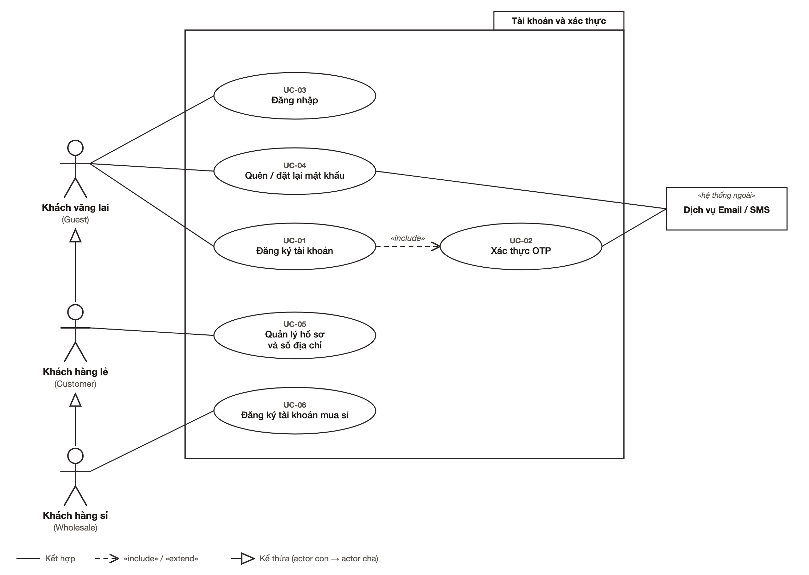
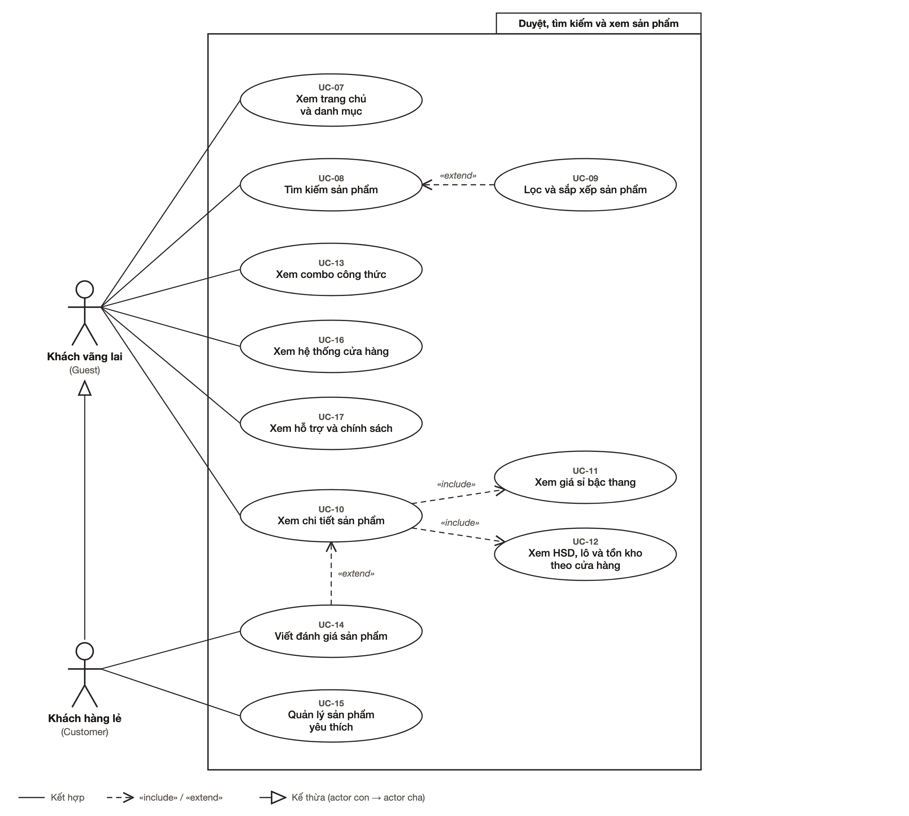
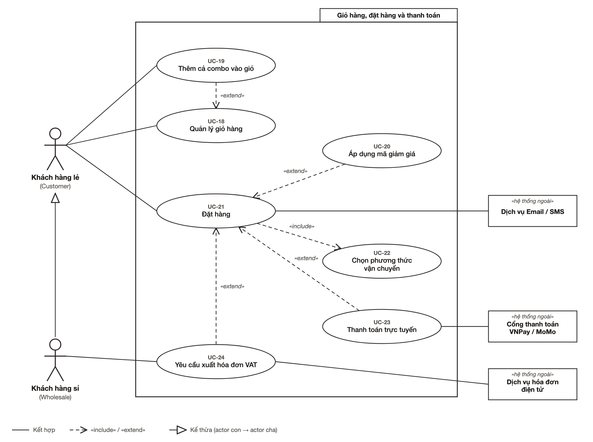
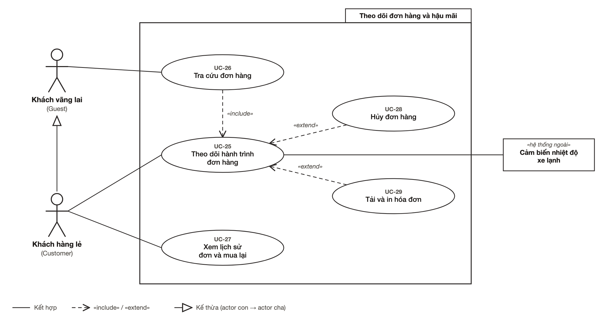
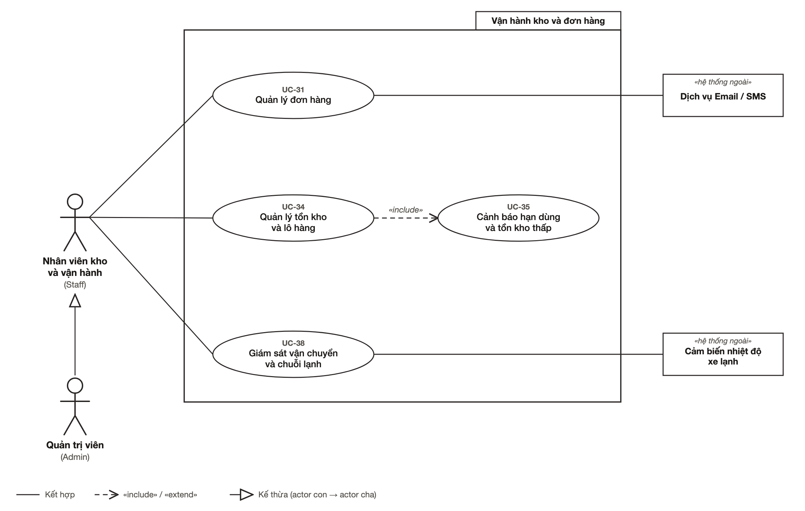
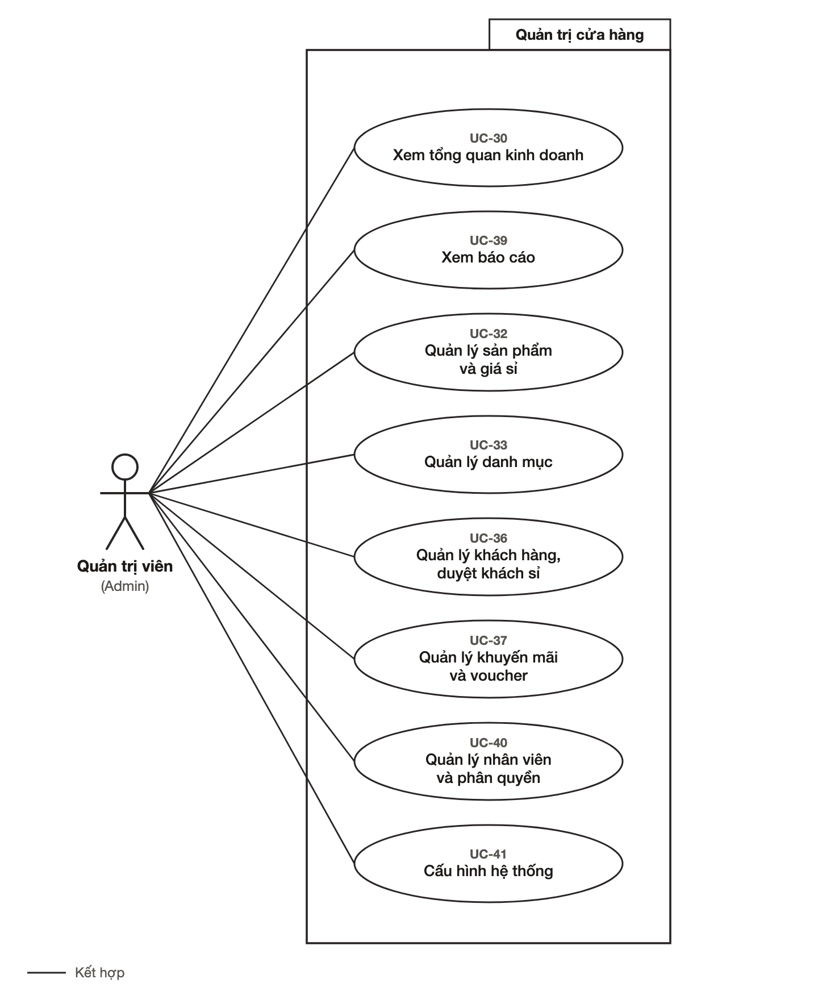

# 05 · Sơ đồ use case (Topic 1)

Sơ đồ use case của hệ thống **Gia Hòa Phát Bakery Supply** (Online Shopping for Baking Ingredients System), vẽ theo bố cục tài liệu mẫu của nhóm: *một sơ đồ tổng quan* rồi *các sơ đồ phân rã*. Tác nhân là **hình người** đứng hai bên khung hệ thống; use case là **elip** xếp thành cột; quan hệ kế thừa giữa tác nhân dùng **mũi tên tam giác rỗng**.

- **Dùng cho nhóm:** dán các ảnh `diagrams/uc-*.png` vào mục *Use case diagram* của SRS. Mã `UC-xx` ở đây do tài liệu này đặt; nếu SRS của nhóm đã có mã khác, sửa mảng `UCS` trong `diagrams/build-use-cases.mjs` rồi chạy lại (mục 7).
- **Dùng cho Antigravity:** đây là tài liệu *tham chiếu* — không phải việc cần làm. Nó cho biết mỗi màn hình phục vụ use case nào (cột "Màn hình" ở mục 6). **Không sửa, không vẽ lại** các file trong `diagrams/`. Việc duy nhất liên quan tới code là **T18 (tùy chọn)**: trang `/dev/use-cases` hiển thị các sơ đồ này (`03_tasks.md`).
- **Đừng đọc nhầm:** `docs/04_use_cases/*` là mẫu của đề tài đặt lịch (Booking), không phải Topic 1 — xem `README.md` mục 2.

**Số liệu:** 5 tác nhân (người) · 4 hệ thống ngoài · 41 use case · 19 chức năng tổng quan · 7 hình · 6 quan hệ «include» · 8 quan hệ «extend» · 3 quan hệ kế thừa.

---

## 1. Cách đọc sơ đồ

| Ký hiệu | Ý nghĩa |
|---|---|
| Hình người que | **Tác nhân** — tên tiếng Việt in đậm, vai trò tiếng Anh trong ngoặc (khớp `role` trong ứng dụng) |
| Hình chữ nhật «hệ thống ngoài» | Hệ thống bên ngoài tương tác với hệ thống (ở prototype chỉ mô phỏng) |
| Elip | **Use case**; dòng nhỏ `UC-xx` là mã. Ở sơ đồ tổng quan, dòng nhỏ liệt kê các use case chi tiết nằm trong chức năng đó |
| Khung chữ nhật, thẻ tên ở góc trên phải | Ranh giới hệ thống (ở hình phân rã, thẻ ghi tên nhóm chức năng) |
| Đường liền | **Kết hợp** — tác nhân dùng use case |
| Nét đứt, mũi tên hở, «include» | Use case gốc **luôn** gọi use case được bao hàm. Mũi tên đi từ *gốc* tới use case *được bao hàm* |
| Nét đứt, mũi tên hở, «extend» | Hành vi **tùy chọn** mở rộng use case gốc. Mũi tên đi từ use case *mở rộng* tới *gốc* |
| Mũi tên tam giác rỗng | **Kế thừa** — tác nhân con (đầu không có mũi tên) làm được mọi việc của tác nhân cha |

## 2. Tác nhân

| Tác nhân | Vai trò | Người dùng demo | Làm được gì | Kế thừa từ |
|---|---|---|---|---|
| Khách vãng lai | Guest | — (chưa đăng nhập) | Xem và tìm sản phẩm, tra cứu đơn, đăng ký, đăng nhập | — |
| Khách hàng lẻ | Customer · `customer` | Trần Mai Anh — thợ làm bánh tại gia | Giỏ hàng, đặt hàng, theo dõi đơn, đánh giá, yêu thích, sổ địa chỉ | Khách vãng lai |
| Khách hàng sỉ | Wholesale · `wholesale_client` | Lê Hoàng Tuấn — Chuỗi tiệm bánh Le Parisien | Mọi việc của khách lẻ, cộng giá sỉ bậc thang, hóa đơn VAT, hồ sơ doanh nghiệp | Khách hàng lẻ |
| Nhân viên kho và vận hành | Staff · `staff` | — (có trong kiểu dữ liệu, không có nút chọn nhanh) | Xử lý đơn, kho và hạn dùng, vận chuyển chuỗi lạnh | — |
| Quản trị viên | Admin · `admin` | Nguyễn Anh Dương | Mọi việc của nhân viên, cộng sản phẩm, danh mục, khách hàng, khuyến mãi, báo cáo, nhân viên, cấu hình | Nhân viên kho và vận hành |

**Hệ thống ngoài** (ở prototype đều là mô phỏng, không kết nối thật):

| Hệ thống | Dùng ở | Trong prototype |
|---|---|---|
| Cổng thanh toán VNPay / MoMo | UC-23 | Khối mã QR tĩnh (`public/qr-demo.svg`) |
| Dịch vụ Email / SMS | UC-02, UC-04, UC-21, UC-31 | Gửi OTP, liên kết đặt lại mật khẩu, email xác nhận đơn, thông báo đổi trạng thái — chỉ hiện thông báo trên màn hình |
| Dịch vụ hóa đơn điện tử | UC-24 | Nút "Tải hóa đơn điện tử (PDF)" giả |
| Cảm biến nhiệt độ xe lạnh | UC-25, UC-38 | Số liệu nhiệt độ thùng viết cứng trong `mocks/shipments.ts` |

## 3. Sơ đồ tổng quan


*Hình 1 — Sơ đồ use case tổng quan. Khách hàng sỉ kế thừa khách hàng lẻ, khách hàng lẻ kế thừa khách vãng lai; quản trị viên kế thừa nhân viên. Ảnh vector: [`diagrams/uc-00-tong-quan.svg`](diagrams/uc-00-tong-quan.svg).*

Mỗi elip là một chức năng chính, tên trùng tên mục menu hoặc trang trong ứng dụng. Bảng dưới cho biết chức năng nào gồm những use case nào và được phân rã ở hình nào.

<!-- uc:features:start -->
| Chức năng tổng quan | Use case chi tiết | Tác nhân | Sơ đồ phân rã |
|---|---|---|---|
| F01 · Đăng ký tài khoản | UC-01, UC-02 | Khách vãng lai | Hình 2 |
| F02 · Đăng nhập, khôi phục mật khẩu | UC-03, UC-04 | Khách vãng lai, Nhân viên kho và vận hành | Hình 2 |
| F03 · Duyệt, tìm kiếm và xem sản phẩm | UC-07 … UC-13 | Khách vãng lai | Hình 3 |
| F04 · Xem cửa hàng và hỗ trợ | UC-16, UC-17 | Khách vãng lai | Hình 3 |
| F05 · Tra cứu đơn hàng | UC-26 | Khách vãng lai | Hình 5 |
| F06 · Quản lý hồ sơ và sổ địa chỉ | UC-05 | Khách hàng lẻ | Hình 2 |
| F07 · Đánh giá, yêu thích sản phẩm | UC-14, UC-15 | Khách hàng lẻ | Hình 3 |
| F08 · Quản lý giỏ hàng | UC-18 … UC-20 | Khách hàng lẻ | Hình 4 |
| F09 · Đặt hàng và thanh toán | UC-21 … UC-23 | Khách hàng lẻ | Hình 4 |
| F10 · Theo dõi và quản lý đơn của tôi | UC-25, UC-27 … UC-29 | Khách hàng lẻ | Hình 5 |
| F11 · Mua sỉ và hóa đơn VAT | UC-06, UC-24 | Khách hàng sỉ | Hình 2, Hình 4 |
| F12 · Quản lý đơn hàng | UC-31 | Nhân viên kho và vận hành | Hình 6 |
| F13 · Quản lý kho và hạn dùng | UC-34, UC-35 | Nhân viên kho và vận hành | Hình 6 |
| F14 · Giám sát vận chuyển, chuỗi lạnh | UC-38 | Nhân viên kho và vận hành | Hình 6 |
| F15 · Quản lý sản phẩm và danh mục | UC-32, UC-33 | Quản trị viên | Hình 7 |
| F16 · Quản lý khách hàng | UC-36 | Quản trị viên | Hình 7 |
| F17 · Quản lý khuyến mãi, voucher | UC-37 | Quản trị viên | Hình 7 |
| F18 · Xem tổng quan và báo cáo | UC-30, UC-39 | Quản trị viên | Hình 7 |
| F19 · Quản lý nhân viên và cấu hình | UC-40, UC-41 | Quản trị viên | Hình 7 |
<!-- uc:features:end -->

## 4. Sơ đồ phân rã

### Hình 2 — Tài khoản và xác thực



Phân rã F01, F02, F06 và UC-06 của F11. Đăng ký (UC-01) luôn kết thúc bằng bước nhập mã OTP (UC-02), nên là «include». Quên mật khẩu (UC-04) chỉ gửi liên kết qua email — không có OTP — đúng với màn hình SCR-14.

### Hình 3 — Duyệt, tìm kiếm và xem sản phẩm



Phân rã F03, F04, F07. Trang chi tiết sản phẩm (UC-10) luôn hiện bảng giá sỉ bậc thang và hạn dùng, lô, tồn kho theo cửa hàng (UC-11, UC-12). Lọc và sắp xếp (UC-09) và viết đánh giá (UC-14) là bước tùy chọn nên dùng «extend». Hai use case của khách lẻ (UC-14, UC-15) nằm ở cuối vì khách vãng lai không dùng được.

### Hình 4 — Giỏ hàng, đặt hàng và thanh toán



Phân rã F08, F09 và UC-24 của F11. Đơn hàng nào cũng phải chọn vận chuyển (UC-22 — «include»). Mã giảm giá, thanh toán trực tuyến và hóa đơn VAT là tùy chọn («extend»): khách chọn COD thì không qua cổng thanh toán; chỉ khách sỉ mới có hóa đơn VAT.

### Hình 5 — Theo dõi đơn hàng và hậu mãi



Phân rã F05 và F10. Tra cứu đơn (UC-26) luôn dẫn tới màn hình theo dõi hành trình (UC-25). Hủy đơn và tải/in hóa đơn là thao tác tùy chọn trên màn hình theo dõi («extend»); nhiệt độ thùng lạnh lấy từ cảm biến.

### Hình 6 — Vận hành kho và đơn hàng



Phân rã F12, F13, F14. Màn hình tồn kho (UC-34) luôn tính và làm nổi cảnh báo hạn dùng, tồn thấp (UC-35). Quản trị viên kế thừa nhân viên nên làm được mọi việc ở hình này mà không cần vẽ thêm đường nối.

### Hình 7 — Quản trị cửa hàng



Phân rã F15 → F19: các chức năng chỉ dành cho quản trị viên.

## 5. Giải thích các quan hệ

| Quan hệ | Vì sao |
|---|---|
| UC-01 «include» UC-02 | Đăng ký nào cũng kết thúc bằng nhập mã OTP |
| UC-10 «include» UC-11 | Trang chi tiết luôn có bảng giá sỉ bậc thang |
| UC-10 «include» UC-12 | Trang chi tiết luôn có hạn dùng, số lô và tồn kho theo cửa hàng |
| UC-21 «include» UC-22 | Đơn nào cũng phải chọn phương thức vận chuyển |
| UC-26 «include» UC-25 | Tra cứu luôn dẫn tới màn hình theo dõi hành trình |
| UC-34 «include» UC-35 | Màn hình tồn kho luôn tính và làm nổi cảnh báo |
| UC-09 «extend» UC-08 | Lọc, sắp xếp là tùy chọn sau khi tìm kiếm hoặc duyệt |
| UC-14 «extend» UC-10 | Viết đánh giá là tùy chọn khi xem chi tiết sản phẩm |
| UC-19 «extend» UC-18 | Thêm cả combo là một cách tùy chọn để đưa hàng vào giỏ |
| UC-20 «extend» UC-21 | Mã giảm giá là tùy chọn |
| UC-23 «extend» UC-21 | Thanh toán trực tuyến là tùy chọn (COD, chuyển khoản không qua cổng) |
| UC-24 «extend» UC-21 | Hóa đơn VAT là tùy chọn, chỉ khách sỉ |
| UC-28 «extend» UC-25 | Hủy đơn chỉ khả dụng khi đơn chưa đóng gói |
| UC-29 «extend» UC-25 | Tải hoặc in hóa đơn là tùy chọn |
| Khách hàng lẻ → Khách vãng lai | Khách đã đăng nhập làm được mọi việc của khách chưa đăng nhập |
| Khách hàng sỉ → Khách hàng lẻ | Khách sỉ là khách lẻ có thêm giá sỉ và hóa đơn VAT |
| Quản trị viên → Nhân viên | Quản trị viên làm được mọi việc của nhân viên |

## 6. Danh mục 41 use case

Cột **Màn hình** nối use case với mã `SCR-xx` trong `02_pages.md`; cột **Yêu cầu** nối với ma trận trong `src/data/swrRequirements.ts`. Ô ghi *đề xuất FR mới* là chức năng chưa có yêu cầu tương ứng trong ma trận — nhóm quyết định có thêm vào SRS hay không (Antigravity không tự sửa SRS). Mô tả chỉ ở mức giao diện prototype: không có xử lý thật phía sau.

<!-- uc:catalogue:start -->
| Mã | Use case | Tác nhân | Mô tả ngắn | Màn hình | Yêu cầu |
|---|---|---|---|---|---|
| UC-01 | Đăng ký tài khoản | Khách vãng lai | Tạo tài khoản bằng họ tên, email hoặc SĐT và mật khẩu; chọn loại tài khoản cá nhân hoặc doanh nghiệp. | SCR-13 | FR-AUTH-01 |
| UC-02 | Xác thực OTP | Khách vãng lai | Nhập mã 6 số gửi qua email hoặc SMS để hoàn tất đăng ký. | SCR-13 (bước 2) | FR-AUTH-01 |
| UC-03 | Đăng nhập | Khách vãng lai, Nhân viên kho và vận hành | Đăng nhập bằng email hoặc SĐT và mật khẩu; mọi vai trò dùng chung một màn hình. | SCR-12 | FR-AUTH-01 |
| UC-04 | Quên / đặt lại mật khẩu | Khách vãng lai | Nhập email để nhận liên kết đặt lại mật khẩu và xem thông báo đã gửi. | SCR-14 | đề xuất FR mới |
| UC-05 | Quản lý hồ sơ và sổ địa chỉ | Khách hàng lẻ | Sửa thông tin cá nhân, đổi mật khẩu, thêm / sửa / xóa địa chỉ giao hàng. | SCR-15, SCR-17, SCR-19 | đề xuất FR mới |
| UC-06 | Đăng ký tài khoản mua sỉ | Khách hàng sỉ | Gửi hồ sơ doanh nghiệp (mã số thuế, giấy phép) để được duyệt và hưởng giá sỉ. | SCR-21, SCR-13, SCR-20 | BR-RULE-02, đề xuất FR mới |
| UC-07 | Xem trang chủ và danh mục | Khách vãng lai | Xem banner, danh mục, sản phẩm bán chạy và mới về, combo, cửa hàng. | SCR-01 | FR-SRC-01, FR-KIT-04 |
| UC-08 | Tìm kiếm sản phẩm | Khách vãng lai | Tìm theo tên, thương hiệu, SKU; có gợi ý tức thì và phím tắt Ctrl/⌘ + K. | SCR-03 (và ô tìm kiếm ở đầu trang) | FR-SRC-01 |
| UC-09 | Lọc và sắp xếp sản phẩm | Khách vãng lai | Lọc theo danh mục, điều kiện bảo quản, thương hiệu, giá, tình trạng; sắp xếp; kết quả nằm trên URL. | SCR-02 | FR-FIL-02 |
| UC-10 | Xem chi tiết sản phẩm | Khách vãng lai | Xem ảnh, giá, mô tả, thông số, đánh giá và sản phẩm liên quan. | SCR-04 | FR-PROD-03 |
| UC-11 | Xem giá sỉ bậc thang | Khách vãng lai | Xem bảng đơn giá giảm dần theo số lượng; dòng đang áp dụng được tô nổi. | SCR-04, SCR-21 | FR-PROD-03, BR-RULE-02 |
| UC-12 | Xem HSD, lô và tồn kho theo cửa hàng | Khách vãng lai | Xem hạn dùng, số lô, số lượng còn và tình trạng hàng ở từng cửa hàng. | SCR-04, SCR-22 | FR-PROD-03 |
| UC-13 | Xem combo công thức | Khách vãng lai | Xem combo nguyên liệu theo món bánh, chọn hoặc bỏ nguyên liệu, xem cách làm. | SCR-05, SCR-06 | FR-KIT-04 |
| UC-14 | Viết đánh giá sản phẩm | Khách hàng lẻ | Chấm sao và viết nhận xét cho sản phẩm. | SCR-04 (tab Đánh giá) | đề xuất FR mới |
| UC-15 | Quản lý sản phẩm yêu thích | Khách hàng lẻ | Thêm hoặc bỏ sản phẩm yêu thích, xem danh sách đã lưu. | SCR-18 (và nút ♡ ở thẻ sản phẩm) | đề xuất FR mới |
| UC-16 | Xem hệ thống cửa hàng | Khách vãng lai | Xem địa chỉ, giờ mở cửa, dịch vụ từng cửa hàng; kiểm tra tồn kho theo cửa hàng. | SCR-22 | đề xuất FR mới |
| UC-17 | Xem hỗ trợ và chính sách | Khách vãng lai | Đọc hướng dẫn đặt hàng, giao hàng lạnh, đổi trả, câu hỏi thường gặp; gửi liên hệ. | SCR-23, SCR-24 | đề xuất FR mới |
| UC-18 | Quản lý giỏ hàng | Khách hàng lẻ | Thêm, xóa, đổi số lượng; xem gợi ý bậc giá kế tiếp và tiến độ miễn phí vận chuyển. | SCR-07 (và giỏ mini) | FR-CART-05, BR-RULE-01, BR-RULE-02 |
| UC-19 | Thêm cả combo vào giỏ | Khách hàng lẻ | Thêm các nguyên liệu đã chọn của một combo vào giỏ trong một thao tác. | SCR-06 | FR-KIT-04 |
| UC-20 | Áp dụng mã giảm giá | Khách hàng lẻ | Nhập voucher (BAKING2026, GHPVIP, FREESHIP) và xem số tiền được giảm. | SCR-07 (giảm giá hiện lại ở SCR-08) | FR-CART-05 |
| UC-21 | Đặt hàng | Khách hàng lẻ | Điền thông tin nhận hàng, chọn vận chuyển và thanh toán, xác nhận đơn. | SCR-08, SCR-09 | FR-CHK-06 |
| UC-22 | Chọn phương thức vận chuyển | Khách hàng lẻ | Giao tiêu chuẩn 25.000₫ hoặc xe lạnh 45.000₫ cho hàng cần bảo quản lạnh. | SCR-08 (bước 2) | FR-CHK-06, BR-RULE-01 |
| UC-23 | Thanh toán trực tuyến | Khách hàng lẻ | Chọn VNPay (hiện mã QR), MoMo hoặc chuyển khoản; thanh toán khi nhận hàng (COD) không qua cổng. | SCR-08 (bước 3) | FR-CHK-06 |
| UC-24 | Yêu cầu xuất hóa đơn VAT | Khách hàng sỉ | Nhập mã số thuế, tên và địa chỉ công ty, email nhận hóa đơn điện tử. | SCR-08 (bước 1), SCR-11 | FR-CHK-06 |
| UC-25 | Theo dõi hành trình đơn hàng | Khách hàng lẻ | Xem 5 mốc xử lý, tài xế, xe và nhiệt độ thùng lạnh của đơn. | SCR-11 | FR-TRK-07 |
| UC-26 | Tra cứu đơn hàng | Khách vãng lai | Nhập mã đơn và SĐT để xem tình trạng đơn mà không cần đăng nhập. | SCR-10 → SCR-11 | FR-TRK-07 |
| UC-27 | Xem lịch sử đơn và mua lại | Khách hàng lẻ | Xem danh sách đơn theo trạng thái; mua lại một đơn cũ. | SCR-16 | FR-TRK-07 |
| UC-28 | Hủy đơn hàng | Khách hàng lẻ | Hủy đơn khi còn ở trạng thái chờ xác nhận hoặc đã xác nhận. | SCR-11, SCR-16 | FR-TRK-07 |
| UC-29 | Tải và in hóa đơn | Khách hàng lẻ | Tải hóa đơn điện tử (PDF) hoặc in phiếu của đơn. | SCR-11, SCR-09 | FR-TRK-07 |
| UC-30 | Xem tổng quan kinh doanh | Quản trị viên | Xem doanh thu, đơn cần xử lý, cảnh báo tồn kho và HSD, chuyến xe lạnh trong ngày. | SCR-A01 | FR-ADM-08 |
| UC-31 | Quản lý đơn hàng | Nhân viên kho và vận hành | Xem danh sách đơn, đổi trạng thái, in phiếu xuất kho, kiểm tra đóng gói lạnh. | SCR-A02, SCR-A03 | FR-ADM-08 |
| UC-32 | Quản lý sản phẩm và giá sỉ | Quản trị viên | Thêm, sửa, ẩn sản phẩm; đặt giá bán và bảng giá bậc thang. | SCR-A04, SCR-A05 | FR-ADM-08 |
| UC-33 | Quản lý danh mục | Quản trị viên | Thêm, sửa, ẩn danh mục sản phẩm. | SCR-A06 | FR-ADM-08 |
| UC-34 | Quản lý tồn kho và lô hàng | Nhân viên kho và vận hành | Nhập xuất kho, sửa số lượng, theo dõi lô và hạn dùng theo nguyên tắc hết hạn trước xuất trước. | SCR-A07 | FR-ADM-08 |
| UC-35 | Cảnh báo hạn dùng và tồn kho thấp | Nhân viên kho và vận hành | Làm nổi lô sắp hết hạn (≤ 30 ngày, ≤ 7 ngày) và sản phẩm dưới ngưỡng tồn. | SCR-A01, SCR-A07 | FR-ADM-08 |
| UC-36 | Quản lý khách hàng, duyệt khách sỉ | Quản trị viên | Xem danh sách khách; duyệt hoặc từ chối hồ sơ doanh nghiệp mua sỉ. | SCR-A08 | đề xuất FR mới |
| UC-37 | Quản lý khuyến mãi và voucher | Quản trị viên | Tạo, bật hoặc tắt voucher giảm cố định, giảm phần trăm, giảm phí vận chuyển. | SCR-A09 | đề xuất FR mới |
| UC-38 | Giám sát vận chuyển và chuỗi lạnh | Nhân viên kho và vận hành | Theo dõi chuyến xe lạnh, nhiệt độ thùng và cảnh báo khi vượt 8°C. | SCR-A10 | BR-RULE-01, đề xuất FR mới |
| UC-39 | Xem báo cáo | Quản trị viên | Xem báo cáo doanh thu, sản phẩm bán chạy, cơ cấu khách; xuất CSV. | SCR-A11 | đề xuất FR mới |
| UC-40 | Quản lý nhân viên và phân quyền | Quản trị viên | Mời nhân viên, gán vai trò, chỉnh ma trận quyền. | SCR-A12 | đề xuất FR mới |
| UC-41 | Cấu hình hệ thống | Quản trị viên | Sửa thông tin cửa hàng, phí vận chuyển, cổng thanh toán, thông báo email. | SCR-A13 | đề xuất FR mới |
<!-- uc:catalogue:end -->

## 7. Sửa và xuất lại sơ đồ

Các file trong `diagrams/` đều sinh ra từ **một script duy nhất**, không cần cài thêm gói nào (cần Node ≥ 22 và Google Chrome để xuất PNG).

```bash
cd client
node ui-spec/diagrams/build-use-cases.mjs             # vẽ lại 7 sơ đồ: .svg + .png (nét x2)
node ui-spec/diagrams/build-use-cases.mjs --write-doc # ghi lại 2 bảng ở mục 3 và mục 6 của file này
```

- Sửa **dữ liệu** ở đầu script: `ACTORS`, `SYSTEMS` (tác nhân, hệ thống ngoài), `UCS` (41 use case), `FEATURES` (19 chức năng tổng quan), rồi các khối `DIAGRAMS.push(...)` (vị trí và các đường nối).
- Script tự kiểm tra: báo `⚠` nếu một đường nối xuyên qua use case khác và in số đường cắt nhau (hiện tại **0**). Thoát mã 1 nếu có cảnh báo.
- Không có Chrome: script vẫn ra `.svg` (đặt `CHROME_PATH=<đường dẫn Chrome>` để xuất `.png`).
- Muốn dán vào Word: dùng `.png` (đã ở nét x2) hoặc chèn `.svg`.

## 8. Hiển thị trong ứng dụng (T18 — tùy chọn, P2)

Nếu nhóm muốn người chấm xem được sơ đồ ngay trong prototype: làm trang **`/dev/use-cases`** (SCR-D03) theo `02_pages.md` và `03_tasks.md` mục T18. Chỉ làm khi đã xong toàn bộ R1 → R16 ở `06_review_round2.md`.
