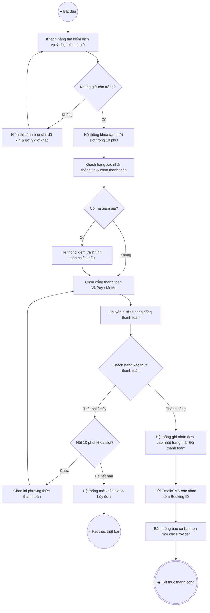

# 🔄 SƠ ĐỒ HOẠT ĐỘNG (ACTIVITY DIAGRAMS)
### Quy trình nghiệp vụ cốt lõi: Đặt lịch và Thanh toán

```mermaid
flowchart TD
    Start((● Bắt đầu)) --> Browse[Khách hàng tìm kiếm dịch vụ & chọn khung giờ]
    Browse --> CheckSlot{Khung giờ còn trống?}

    CheckSlot -- Không --> AlertSlot[Hiển thị cảnh báo slot đã kín & gợi ý giờ khác]
    AlertSlot --> Browse

    CheckSlot -- Có --> LockSlot[Hệ thống khóa tạm thời slot trong 10 phút]
    LockSlot --> InputInfo[Khách hàng xác nhận thông tin & chọn thanh toán]

    InputInfo --> ApplyVoucher{Có mã giảm giá?}
    ApplyVoucher -- Có --> ValidateVoucher[Hệ thống kiểm tra & tính toán chiết khấu]
    ApplyVoucher -- Không --> SelectGateway[Chọn cổng thanh toán VNPay / MoMo]
    ValidateVoucher --> SelectGateway

    SelectGateway --> RedirectGateway[Chuyển hướng sang cổng thanh toán]
    RedirectGateway --> ProcessPayment{Khách hàng xác thực thanh toán}

    ProcessPayment -- Thất bại / Hủy --> TimeoutCheck{Hết 10 phút khóa slot?}
    TimeoutCheck -- Chưa --> RetryPayment[Chọn lại phương thức thanh toán]
    RetryPayment --> SelectGateway
    TimeoutCheck -- Đã hết hạn --> ReleaseSlot[Hệ thống mở khóa slot & hủy đơn]
    ReleaseSlot --> EndFail((○ Kết thúc thất bại))

    ProcessPayment -- Thành công --> RecordDB[Hệ thống ghi nhận đơn, cập nhật trạng thái 'Đã thanh toán']
    RecordDB --> SendNoti[Gửi Email/SMS xác nhận kèm Booking ID]
    SendNoti --> NotifyProvider[Bắn thông báo có lịch hẹn mới cho Provider]
    NotifyProvider --> EndSuccess(((◉ Kết thúc thành công)))
```
