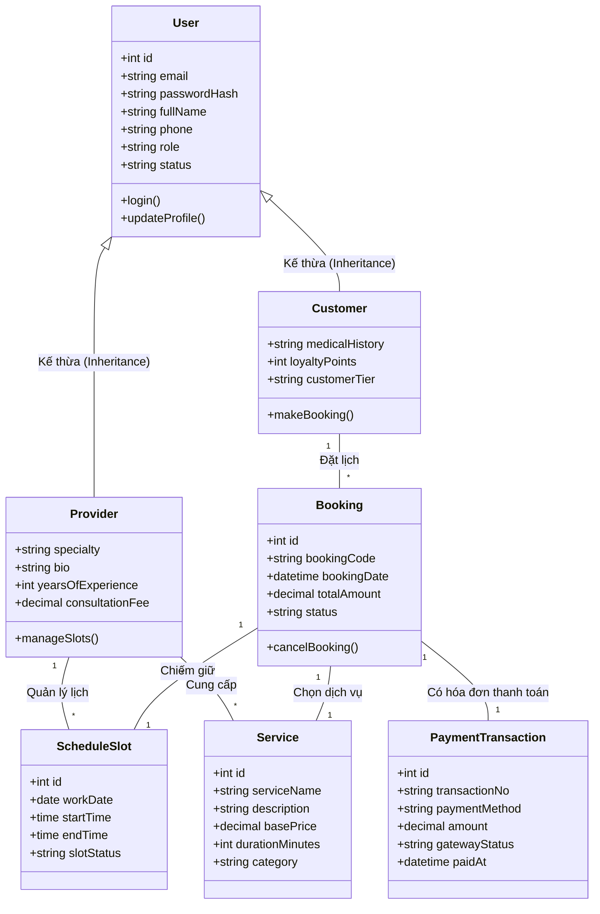

# 🏛️ MÔ HÌNH MIỀN (DOMAIN MODEL / CONCEPTUAL CLASS DIAGRAM)

> Mô hình lớp khái niệm thể hiện các thực thể cốt lõi trong bài toán và quan hệ giữa chúng.

```mermaid
classDiagram
    class User {
        +int id
        +string email
        +string passwordHash
        +string fullName
        +string phone
        +string role
        +string status
        +login()
        +updateProfile()
    }

    class Customer {
        +string medicalHistory
        +int loyaltyPoints
        +string customerTier
        +makeBooking()
    }

    class Provider {
        +string specialty
        +string bio
        +int yearsOfExperience
        +decimal consultationFee
        +manageSlots()
    }

    class Service {
        +int id
        +string serviceName
        +string description
        +decimal basePrice
        +int durationMinutes
        +string category
    }

    class ScheduleSlot {
        +int id
        +date workDate
        +time startTime
        +time endTime
        +string slotStatus
    }

    class Booking {
        +int id
        +string bookingCode
        +datetime bookingDate
        +decimal totalAmount
        +string status
        +cancelBooking()
    }

    class PaymentTransaction {
        +int id
        +string transactionNo
        +string paymentMethod
        +decimal amount
        +string gatewayStatus
        +datetime paidAt
    }

    %% Relationships
    User <|-- Customer : Kế thừa (Inheritance)
    User <|-- Provider : Kế thừa (Inheritance)
    Provider "1" -- "*" ScheduleSlot : Quản lý lịch
    Provider "*" -- "*" Service : Cung cấp
    Customer "1" -- "*" Booking : Đặt lịch
    Booking "1" -- "1" ScheduleSlot : Chiếm giữ
    Booking "1" -- "1" Service : Chọn dịch vụ
    Booking "1" -- "1" PaymentTransaction : Có hóa đơn thanh toán
```
