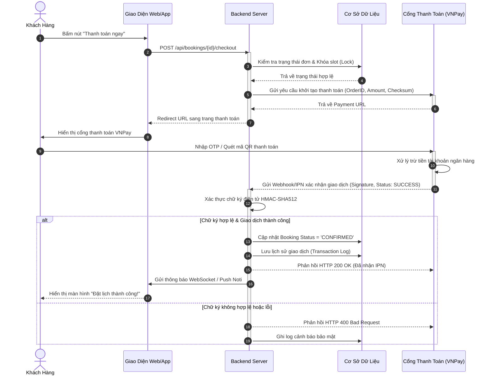

# ⚡ SƠ ĐỒ TRÌNH TỰ (SEQUENCE DIAGRAMS)
### Nghiệp vụ: Xác thực thanh toán trực tuyến qua Webhook

```mermaid
sequenceDiagram
    autonumber
    actor User as Khách Hàng
    participant UI as Giao Diện Web/App
    participant API as Backend Server
    participant DB as Cơ Sở Dữ Liệu
    participant GW as Cổng Thanh Toán (VNPay)

    User->>UI: Bấm nút "Thanh toán ngay"
    UI->>API: POST /api/bookings/{id}/checkout
    activate API
    API->>DB: Kiểm tra trạng thái đơn & Khóa slot (Lock)
    DB-->>API: Trả về trạng thái hợp lệ
    API->>GW: Gửi yêu cầu khởi tạo thanh toán (OrderID, Amount, Checksum)
    activate GW
    GW-->>API: Trả về Payment URL
    deactivate GW
    API-->>UI: Redirect URL sang trang thanh toán
    deactivate API

    UI->>User: Hiển thị cổng thanh toán VNPay
    User->>GW: Nhập OTP / Quét mã QR thanh toán
    activate GW
    GW->>GW: Xử lý trừ tiền tài khoản ngân hàng
    GW-->>API: Gửi Webhook/IPN xác nhận giao dịch (Signature, Status: SUCCESS)
    deactivate GW

    activate API
    API->>API: Xác thực chữ ký điện tử HMAC-SHA512
    alt Chữ ký hợp lệ & Giao dịch thành công
        API->>DB: Cập nhật Booking Status = 'CONFIRMED'
        API->>DB: Lưu lịch sử giao dịch (Transaction Log)
        API-->>GW: Phản hồi HTTP 200 OK (Đã nhận IPN)
        API->>UI: Gửi thông báo WebSocket / Push Noti
        UI-->>User: Hiển thị màn hình "Đặt lịch thành công!"
    else Chữ ký không hợp lệ hoặc lỗi
        API-->>GW: Phản hồi HTTP 400 Bad Request
        API->>DB: Ghi log cảnh báo bảo mật
    end
    deactivate API
```
