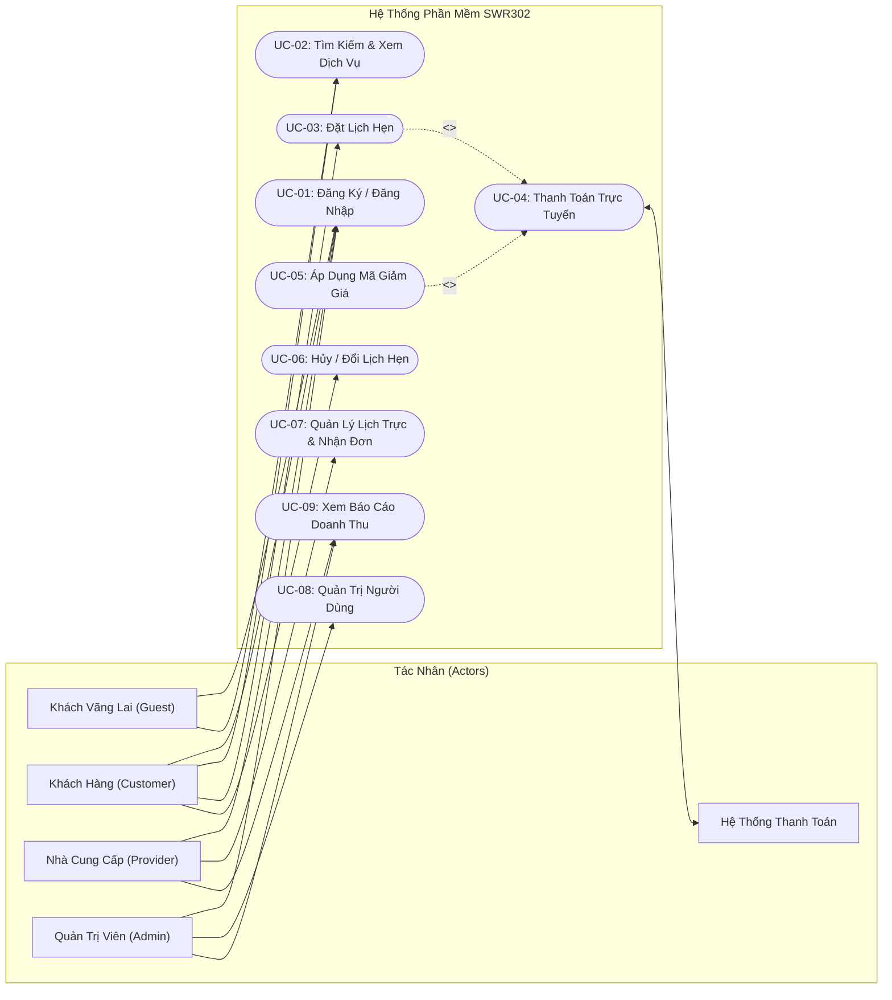

# 📊 SƠ ĐỒ USE CASE TỔNG THỂ (USE CASE DIAGRAM)

> Sơ đồ được dựng bằng cú pháp **Mermaid.js**, tự động render trực tiếp trên GitHub, VS Code và Antigravity IDE.

```mermaid
flowchart LR
    %% Actors
    subgraph Actors["Tác Nhân (Actors)"]
        Guest["Khách Vãng Lai (Guest)"]
        Customer["Khách Hàng (Customer)"]
        Provider["Nhà Cung Cấp (Provider)"]
        Admin["Quản Trị Viên (Admin)"]
        PaymentSystem["Hệ Thống Thanh Toán"]
    end

    %% Use Cases Boundary
    subgraph SystemBoundary["Hệ Thống Phần Mềm SWR302"]
        UC01(["UC-01: Đăng Ký / Đăng Nhập"])
        UC02(["UC-02: Tìm Kiếm & Xem Dịch Vụ"])
        UC03(["UC-03: Đặt Lịch Hẹn"])
        UC04(["UC-04: Thanh Toán Trực Tuyến"])
        UC05(["UC-05: Áp Dụng Mã Giảm Giá"])
        UC06(["UC-06: Hủy / Đổi Lịch Hẹn"])
        UC07(["UC-07: Quản Lý Lịch Trực & Nhận Đơn"])
        UC08(["UC-08: Quản Trị Người Dùng"])
        UC09(["UC-09: Xem Báo Cáo Doanh Thu"])
    end

    %% Interactions
    Guest --> UC01
    Guest --> UC02

    Customer --> UC01
    Customer --> UC02
    Customer --> UC03
    Customer --> UC06

    Provider --> UC01
    Provider --> UC07
    Provider --> UC09

    Admin --> UC01
    Admin --> UC08
    Admin --> UC09

    %% Includes & Extends
    UC03 -.->|"<<include>>"| UC04
    UC05 -.->|"<<extend>>"| UC04
    UC04 <--> PaymentSystem
```
