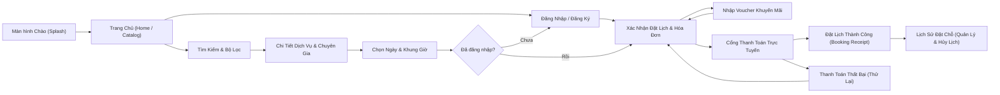

# 📱 SƠ ĐỒ LUỒNG MÀN HÌNH (SCREEN FLOW / UI FLOW)

---

## DANH SÁCH MÃ MÀN HÌNH (SCREEN SPECIFICATION)
| Mã màn hình | Tên màn hình | Chức năng chính | Use Case liên quan |
| :---: | :--- | :--- | :---: |
| **SCR-01** | Landing Page / Trang chủ | Banner nổi bật, tìm kiếm nhanh, top dịch vụ được ưa thích | `UC-02` |
| **SCR-02** | Login / Register Modal | Đăng nhập bằng Email/Password hoặc Google OAuth | `UC-01` |
| **SCR-03** | Service Detail Page | Thông tin dịch vụ, chuyên gia, đánh giá, bảng giá | `UC-02` |
| **SCR-04** | Booking Calendar Slot | Lịch chọn ngày, các slot giờ còn trống theo thời gian thực | `UC-03` |
| **SCR-05** | Checkout & Payment | Tóm tắt đơn hàng, áp voucher, chọn cổng VNPay/MoMo | `UC-04` |
| **SCR-06** | Booking Confirmation Receipt | Hiển thị mã QR check-in, mã Booking ID, hướng dẫn đường đi | `UC-03`, `UC-04` |
| **SCR-07** | Admin Dashboard | Biểu đồ doanh thu, thống kê lượt đặt, quản lý người dùng | `UC-08`, `UC-10` |
