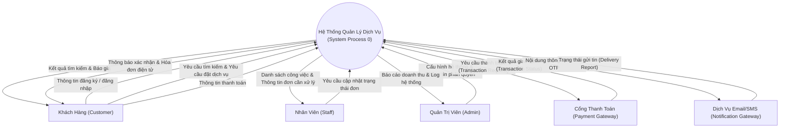

# 🌐 SƠ ĐỒ NGỮ CẢNH HỆ THỐNG (CONTEXT DIAGRAM - DFD LEVEL 0)
### Trọng tâm thi Practical Exam (PE) môn SWR302

> **Định nghĩa:** Context Diagram (Sơ đồ ngữ cảnh) là biểu đồ mức cao nhất (DFD Level 0) biểu diễn toàn bộ hệ thống như một tiến trình duy nhất (Single Process), kết nối với các thực thể ngoài (External Entities / Terminators) thông qua các dòng dữ liệu vào/ra (Data Flows).

---

## 1. CÁC QUY TẮC CỐT LÕI (PE RULES)
1. **Tiến trình trung tâm (System Process):** Chỉ có DUY NHẤT 1 hình tròn (hoặc hình chữ nhật bo tròn) ở giữa, đặt tên là `[Tên Hệ Thống], Process 0`.
2. **Thực thể ngoài (External Entities):** Vẽ hình chữ nhật xung quanh, đại diện cho người dùng, tổ chức, hoặc hệ thống bên ngoài tương tác với hệ thống.
3. **Dòng dữ liệu (Data Flows):** Mũi tên có hướng, đặt tên là **Danh từ** hoặc **Cụm danh từ** (Tuyệt đối KHÔNG dùng động từ làm tên dòng dữ liệu!).
4. **KHÔNG CÓ Kho lưu trữ dữ liệu (Data Store):** Không được vẽ Data Store ở Context Diagram.

---

## 2. BIỂU ĐỒ MẪU (MERMAID SYNTAX)

---

## 3. BẢNG MÔ TẢ CÁC THỰC THỂ NGOÀI & DÒNG DỮ LIỆU

| Thực thể ngoài (Entity) | Dữ liệu gửi vào hệ thống (Input Data Flow) | Dữ liệu nhận từ hệ thống (Output Data Flow) |
| :--- | :--- | :--- |
| **Khách Hàng** | Thông tin tài khoản, Yêu cầu đặt dịch vụ, Thông tin thanh toán | Kết quả tìm kiếm, Xác nhận đặt lịch, Hóa đơn |
| **Nhân Viên** | Cập nhật ca làm việc, Trạng thái xử lý dịch vụ | Danh sách lịch hẹn, Báo cáo công việc ngày |
| **Quản Trị Viên** | Cấu hình tham số hệ thống, Danh mục dịch vụ | Báo cáo tài chính, Báo cáo người dùng, Audit log |
| **Cổng Thanh Toán** | Kết quả thanh toán (Success / Failed / Callback) | Yêu cầu khởi tạo thanh toán (Amount, OrderID) |
| **Hệ Thống SMS/Email**| Báo cáo gửi thành công (Delivery receipt) | Dữ liệu gửi tin (Số điện thoại, Nội dung OTP) |
